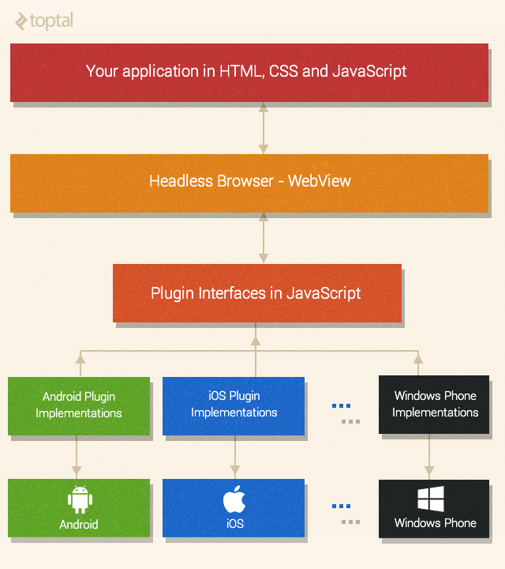
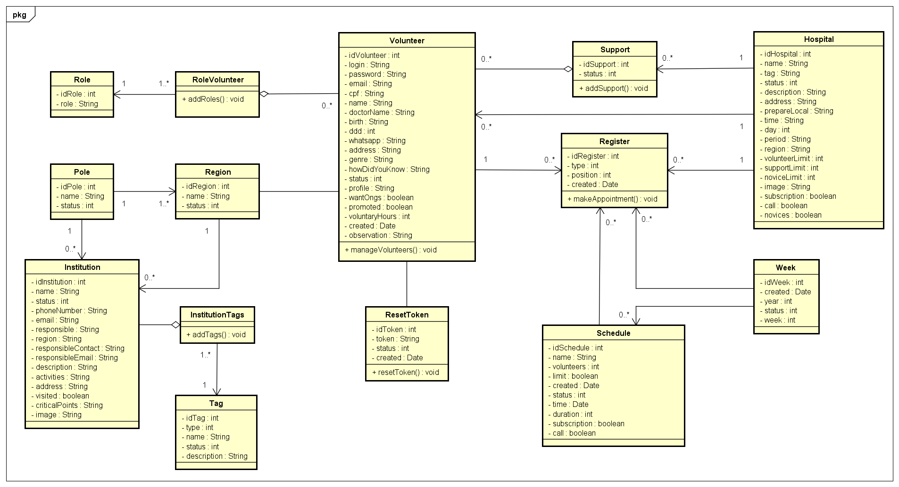

# Histórico de versões
|Data			|Versão		|Descrição			|Autor                   |
| ----------------------------| --------------------------- | ------------------------------------  | ----------------------|
|21/03/2018                 |1.0                             |Criação do documento de arquitetura   |João Vítor, Luciano, Rômulo e Sara  |

# Sumário

[1. Introdução](#1-introdução)

* [1.1 Finalidade](#11-finalidade)
* [1.2 Escopo](#12-escopo)
* [1.3 Referências](#13-referências)
* [1.4 Visão Geral](#14-visão-geral)

[2. Representação da Arquitetura](#2-representação-da-arquitetura)

* [2.1 Arquitetura django REST](#21-arquitetura-django-rest)
* [2.2 Arquitetura Ionic Framework](#22-arquitetura-ionic-framework)

[3. Metas e Restrições de Arquitetura](#3-metas-e-restrições-de-arquitetura)

[4. Visão Lógica](#4-visão-lógica)

* [4.1 Diagrama de Classes](#41-diagrama-de-classes)

[5. Visão de Implementação](#5-visão-de-implementação)

[6. Qualidade](#6-qualidade)

# Documento de Arquitetura
## 1. Introdução

### 1.1. Finalidade

A criação de um software está ligada à definição da sua arquitetura. Este documento tem como objetivo esclarecer essa relação, contextualizada no projeto Laços da Alegria. Para isso, será detalhado como serão trabalhadas as linguagens Python, através do Django Rest Framework e HTML, CSS, JavaScript, através do Ionic Framework.

### 1.2. Escopo

Este documento descreve toda a arquitetura utilizada para a implementação do projeto Laços da Alegria, explica as tecnologias django REST e Ionic que serão utilizadas e possibilita uma visão ampla do projeto, assim, facilitando sua compreensão e entendimento.

### 1.3. Referências

PADRÕES ARQUITETURAIS MVC X ARQUITETURA DO DJANGO. Disponível em:
<https://github.com/fga-gpp-mds/A-Disciplina/wiki/Padr%C3%B5es-Arquiteturais---MVC-X-Arquitetura-do-Django>. Acesso em: 17 mar. 2018.

DOCUMENTO DE ARQUITETURA DE SOFTWARE (DAS). Disponível em: <https://github.com/DroidFoundry/DroidMetronome/wiki/Documento-de-Arquitetura-de-Software-(DAS)#11-finalidade>. Acesso em: 17 mar. 2018.

### 1.4. Visão geral

O documento detalha a arquitetura utilizada no projeto, justificando escolhas de padrões arquiteturais, linguagens, frameworks e ainda a representa o modelo de arquitetura utilizado e sua aplicação nas duas tecnologias escolhidas, Ionic Framework e Django Rest Framework além de suas metas e restrições, visão lógica, visão de implementação e, por fim, a qualidade.

## 2. Representação da Arquitetura

### 2.1. Arquitetura django REST

O django REST é um framework muito utilizado para a construção de APIs em plataforma Web. Praticamente todos os arquivos dessa arquitetura são em python e esses arquivos representam as classes do projeto. Por exemplo, um arquivo views.py contém tudo que uma pasta views teria no modelo arquitetural MVC.

### 2.2. Arquitetura Ionic Framework

O Ionic é um framework front-end e open-source para desenvolvimento de aplicativos móveis híbridos escritos em html, css e JavaScript. Com ele é possível escrever o código da aplicação apenas uma vez para rodar no iPhone, Android e Windows Phone.

O Ionic, através do Apache Cordova, ajuda na comunicação com as APIs (Application Program Interface) de cada Sistema Operacional Móvel  que, por sua vez, comunicam-se com um componente chamado Web View, usado por aplicativos nativos para visualização de páginas web dentro do contexto dos aplicativos móveis). O aplicativo Ionic funciona de forma embarcada dentro dessa Web View, que interpreta e renderiza nosso código html, css e JavaScript.

O framework é baseado no AngularJS e por isso é necessário escrever diretivas do Angular e usar os seus módulos: services, controllers, routes, etc.

O Ionic estiliza nossos componentes html para se parecer com os componentes nativos de cada plataforma móvel, simulando a experiência nativa do usuário final e usa esse ‘navegador’ para rodar os aplicativos e disponibiliza bibliotecas JavaScript para acesso do hardware e tecnologias nativas como câmera, GPS, Bluetooth, entre outros; além de que também é possível rodar essas aplicação em um navegador web.

A aplicação é empacotada em arquivos instaláveis para cada plataforma móvel que então passa a ficar disponível nas principais lojas de aplicativos móveis e ser distribuída para o público-alvo.

## 3. Metas e Restrições de Arquitetura

O desenvolvimento do projeto será com o Ionic Framework 3.x.x junto com o Django Rest 3.7.7 e para utilização das ferramentas são necessários alguns requerimentos como Python 3.6.4, Django 2.0.3 e Nodejs 6.9.4. 

O desenvolvimento deverá estar de acordo as boas práticas de programação e requisitos não funcionais para que facilite a manutenção por outras equipes.

Laços da Alegria será um aplicativo nativo que deverá rodar apenas em versões superiores a 4.1 do Android e 7.0 do IOS, essa restrição é baseada nos requerimentos das tecnologias usadas para o desenvolvimento do projeto. Além disso, para que o aplicativo funcione será necessário conexão com a internet.

## 4. Visão lógica

### 4.1. Diagrama de classes

A lógica do projeto será baseado no diagrama de classes abaixo, que está sujeito a alterações ao longo do desenvolvimento.

## 5. Visão de Implementação

A proposta da arquitetura MVC( Model, View, Controller) é fazer uma divisão em 3 camadas sobrepostas, de uma forma que o usuário só irá interagir com uma delas, no caso a View. Cada parte tem um valor diferente:

* Modelos (models) - Armazenamento de dados, definição dos estados das camadas e interpretação de requisições, que será controlada pelo Django Rest.
* Visão (views) - Controle de layout e definição de design, que será controlada pelo Ionic.
* Controles (controllers) - Tráfego de informações entre todas as camadas, entre o Django Rest e o Ionic Framework.

## 6. Qualidade

O aplicativo seguirá o padrão de desenvolvimento definido nos frameworks utilizados que irá organizar as diversas camadas da aplicação sendo que cada camada tem sua função específica dentro do software. Onde será mantida uma boa organização do código facilitando a visualização, entendimento e implementação do código.
