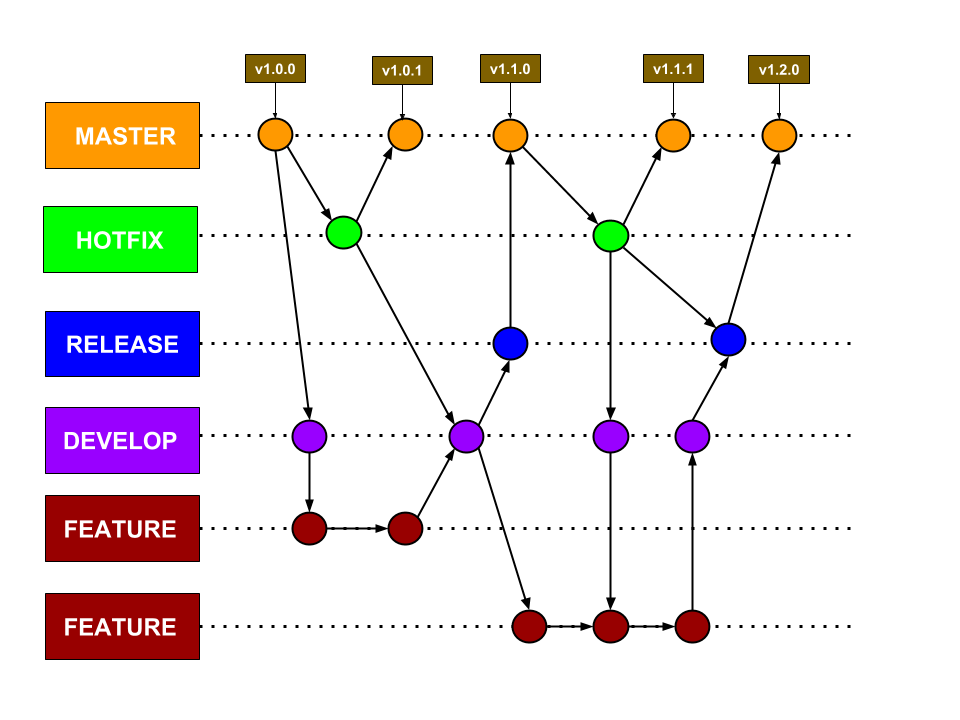

# Política de _Branchs_

## 1. Introdução

Esse documento tem como objetivo padronizar a nomenclatura e uso de _branchs_ no repositório. Como base foi utilizado o modelo de _branchs_ do [_gitflow_ ](https://danielkummer.github.io/git-flow-cheatsheet/index.pt_BR.html) como mostrado na imagem a seguir.

## 2. Branchs

Esse repositório trabalhará com cinco tipos de _branchs_: master, _bugfix_, release, develop e feature. Abaixo segue uma descrição de cada uma:

* **Master:** É a _branch_ que contém código em nível de produção, ou seja, o código mais maduro existente na aplicação. Todo o código novo produzido eventualmente é juntado com a branch master, em algum momento do desenvolvimento;

* **_Hotfix_:** São branches no qual são realizadas correções de bugs críticos encontrados em ambiente de produção, e que por isso são criadas a partir da _branch_ master, e são juntadas diretamente com a _branch_ master e com a _branch_ develop e com a _branch_ release, se estiver alguma ativa (pois os próximos deploys também devem receber correções de bugs críticos). Por convenção, essas branches tem o nome começando com hotfix/ e terminando com o próximo sub-número de versão (exemplo: hotfix/2.31.1);

* **Release:** São branches com um nível de confiança maior do que a branch develop, e que se encontram em nível de preparação para ser juntada com a branch master e com a branch develop (para caso tenha ocorrido alguma correção de bug na branch release/* em questão). Note que, nessas branches, bugs encontrados durante os testes das features que vão para produção podem ser corrigidos mais tranquilamente, antes de irem efetivamente para produção. Essa é a _branch_ usada para fazer a homologação de novas features. Por convenção, essas branches tem o nome começando com release/ e terminando com o número da próxima versão do software (seguindo o exemplo do hotfix, dado acima, seria algo como release/2.32.0);

*  **Develop:** É a _branch_ que contém código em nível preparatório para o próximo deploy. Ou seja, quando features são terminadas, elas são juntadas com a branch develop, testadas (em conjunto, no caso de mais de uma feature), e somente depois as atualizações da branch develop passam pela fase de homologação e, se aprovadas, são juntadas com a branch master para produção. Sempre que uma correção for feita (_hotfix_) essa _branch_ deverá ser atualizada;

* **Feature:** São branches no qual são desenvolvidos recursos novos para o projeto em questão. Essas branches tem por convenção nome começando com feature/#issue_description (exemplo: feature/#59_new_layout) e são criadas a partir da branch develop (pois um recurso pode depender diretamente de outro recurso em algumas situações), e, ao final, são juntadas com a branch develop.
