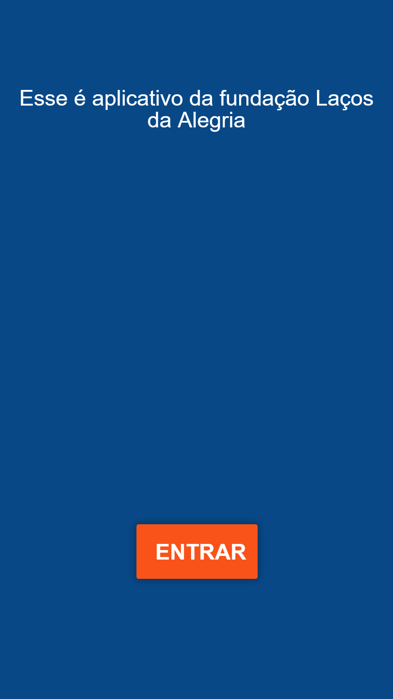
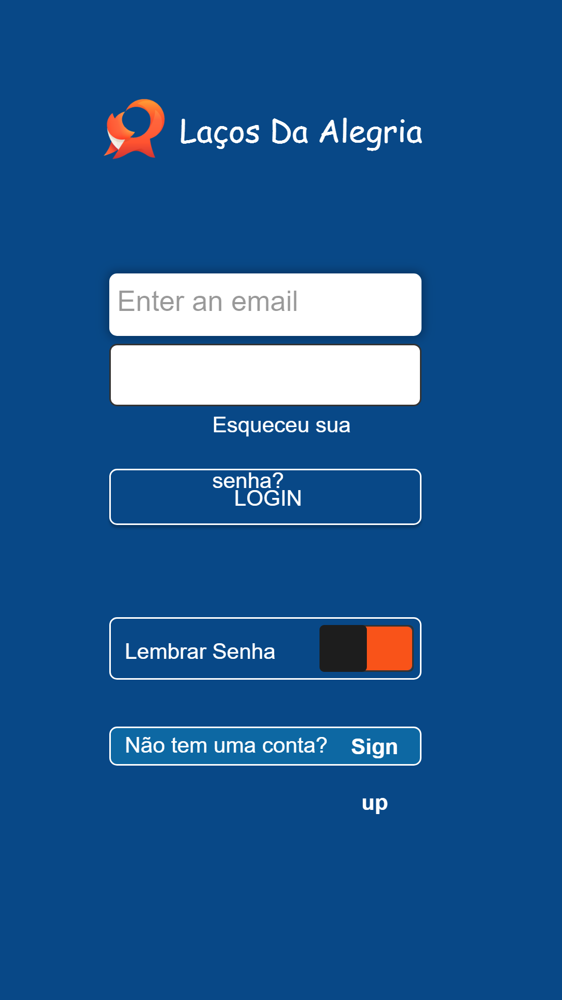
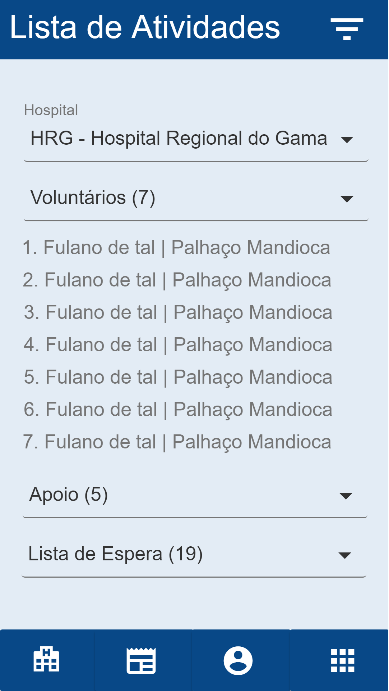

# Histórico de revisões
|Data			|Versão		|Descrição			|Autor                   |
| ----------------------------| --------------------------- | ------------------------------------  | ----------------------|
|27/03/2018                 |0.1                             |Criação do Protótipo    |Rafael Makaha   |
|04/04/2018                 |0.2                             |Adição de parágrafos explicativos  |Renan Schadt |
|04/04/2018                 |1.0                             |Formatação do documento e adição de imagens                |João Vítor  |

# Sumário

[1. Documentação do Protótipo](#1-documentação-do-protótipo)
* [1.1 Tela Inicial](#11-tela-inicial)
* [1.2 Tela de Login](#12-tela-de-login)
* [1.3 Tela de Atividades](#13-tela-de-atividades)
* [1.4 Tela de Novidades](#14-tela-de-novidades)
* [1.5 Tela de Menu](#15-tela-de-menu)
* [1.6 Tela de Perfil](#16-tela-de-perfil)
* [1.7 Tela de Lista da Atividade](#17-tela-de-lista-da-atividade)

# 1. Documentação do Protótipo
Este documento tem por função apresentar as telas do protótipo desenvolvido pelo grupo e as funções de cada uma delas, simulando em partes o que seria a aplicação final da Laços da Alegria. O protótipo feito contém 7 das principais telas da aplicação, este foi apresentado ao cliente e aprovado pelo mesmo, mas nada impede futuras mudanças.

O cliente permitiu que a palheta de cores e o conteúdo de cada tela fosse decidido pelo grupo, com o objetivo de fazer um aplicativo minimalista e claro, que reflete os princípios da Laços da Alegria.

## 1.1 Tela Inicial

A tela inicial somente aparece quando o usuário abre o aplicativo pela primeira vez, ela conta com um botão entrar que redireciona o usuário para página de login/cadastro. Ela também contém uma splash screen, que apresenta as funcionalidades do aplicativo, a navegação entre as splash screen é feita através de swipe.

## 1.2 Tela de Login

Tela para o usuário fazer login ou iniciar seu cadastro, conta com os campos nome de usuário e senha. Depois de inserir os dados corretos e clicar em login, o usuário é redirecionado para página principal do aplicativo, que é a página de atividades.
Ao clicar em cadastrar, ele é redirecionado para página de cadastro.

## 1.3 Tela de Atividades

Tela principal do aplicativo, nela o voluntário pode se inscrever para uma visita a um hospital de sua preferência, ao clicar em participar, seu nome é colocado em uma lista, e dessa lista serão sorteados os que irão realmente participar da visita, o restante entra em uma fila de espera. Caso o usuário esteja na fila de espera, sua posição deve ser mostrada nessa aba do aplicativo.

O botão "participar" se torna "cancelar" quando o usuário está na lista de determinada atividade, para que ele possa cancelar sua visita caso desista dela em decorrer de algum imprevisto.

## 1.4 Tela de Novidades
  

Esta tela mostra um histórico ordenado das notificações enviadas ao usuário, exibindo notícias da instituição, lembretes de visitas, avisos, entre outros.

## 1.5 Tela de Menu
  

Esta não é uma tela propriamente dita, é um menu ativado por swipe, ou através de um toque no ícone de menu no topo do aplicativo. Assim que é aberto ele ocupa uma parte da tela, ficando sobre parte da aba que está ativa no momento.

Este menu exibe como opções todas as abas do aplicativo (lista de atividades, lista de novidades, perfil, configurações, ajuda, entre outros), podendo acessá-las com um toque, e foi o meio de navegação escolhido pelo grupo.

## 1.6 Tela de Perfil
  

Tela de perfil do usuário, é acessada através do menu, mostra dados do usuário, como sua localização, categoria atual(novato, voluntário, apoio), conquistas pessoais no aplicativo e um botão para alterar informações pessoais.

## 1.7 Tela de Lista da Atividade
  

Tela acessível a voluntários e apoio, exibe a lista de usuários inscritos em uma determinada atividade na semana. Contém uma barra de seleção para escolher a atividade, divide os usuários entre novatos, voluntários e apoio.

Informações do usuário que são exibidas: nome, "nome de palhaço" e número do celular.
