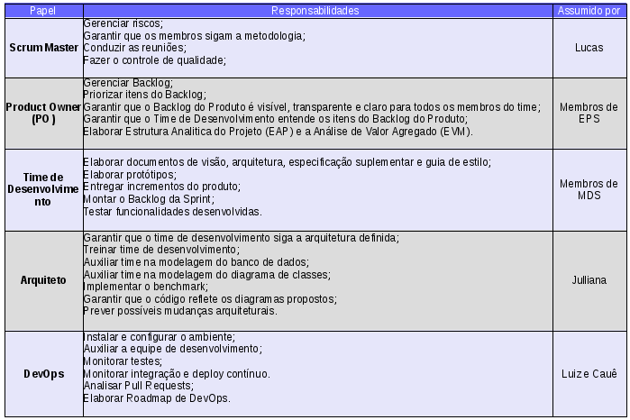

# 1. Introdução  

Este documento tem como objetivo definir e explicitar a metodologia utilizada para o desenvolvimento do aplicativo Intra Laços.
Serão abordados os papéis, eventos e recursos.

# 2. Práticas Adotadas

Serão utilizadas práticas do Framework Scrum com adaptações para incorporar outros papéis e práticas do Extreme Programming (XP) e Kanban.
A seguir são especificados os papéis, eventos e artefatos.

## 2.1. Papéis

## 2.2 Eventos

Ocorrem cinco eventos durante o desenvolvimento do projeto. São eles: Sprint, Encontros Diários e Planejamento, Revisão e Retrospectiva da Sprint.
Todos os eventos possuem um timebox, isto é, um tempo definido para que os eventos ocorram, que não deve ser ultrapassado e é gerenciado pelo Scrum Master.

### 2.1.1 Sprint

A Sprint é um período de uma semana, iniciada nas quartas-feiras, em que um incremento de produto é criado.
Uma nova Sprint e logo após uma ser terminada.

Uma Sprint consiste de e contém Encontros Diários e Planejamento, Revisão e Retrospectiva da Sprint.

Uma Sprint pode ser cancelada antes de seu timebox. Somente o PO tem autoridade para cancelar uma Sprint e isso ocorre quando seu objetivo se torna obsoleto.
Quando uma Sprint é cancelada todos os produtos "prontos" são revisados e se eles forem entregáveis, o PO pode aceitá-las.
As que não forem retornam para o Backlog do Produto.

### 2.2.2 Encontros Diários

Este é um evento com timebox de 15 minutos em que cada membro do time deve responder três perguntas:

* O que eu fiz ontem que ajudou o time a cumprir o objetivo da Sprint?
* O que eu farei hoje para ajudar o time a cumprir o objetivo da Sprint?
* Existe algum problema me impedindo de alcançar o objetivo da Sprint?

Esses encontros têm o objetivo de alinhar a equipe sobre o andamento da Sprint e remover possíveis impedimentos.

### 2.2.3 Planejamento da Sprint

O Planejamento da Sprint é quando o trabalho a ser elaborado na Sprint é definido.
O planejamento é feito por todos os membros em conjunto e possui um timebox de uma hora.

Durante este evento o PO apresenta o objetivo da Sprint e os itens do Backlog do Produto que, se forem entregues, alcançará esse objetivo.
O número de itens selecionados e definido pelo Time de Desenvolvimento e somente ele pode avaliar o que pode ser completado na próxima Sprint.

No final do Planejamento da Sprint, o Time de Desenvolvimento deve ser capaz de explicar ao PO e ao Scrum Master como pretende trabalhar para cumprir o planejado.

### 2.2.4 Revisão da Sprint

A Revisão da Sprint é realizada ao final da Sprint para inspecionar o incremento.
Durante essa reunião é discutido o que foi feito na Sprint, quais problemas ocorreram e como foram resolvidos, o que foi bem e o PO esclarece quais itens foram "prontos". A reunião tem duração de 20 minutos.

### 2.2.5 Retrospectiva da Sprint

Ocorre após a Revisão da Sprint e tem como objetivo a auto avaliação do time e a criação de um plano de melhorias para a próxima reunião.
A Retrospectiva tem timebox de 25 minutos e durante esse tempo o time aponta os pontos positivos, negativos e melhorias a serem aplicadas na próxima Sprint.

## 2.3 Artefatos

### 2.3.1 Backlog do Produto

O Backlog do Produto é uma lista de tudo que deve constar no produto.
Ela é mantida e ordenada pelo PO e este também é responsável pela clareza e entendimento de cada item.

### 2.3.2 Backlog da Sprint

O Backlog da Sprint é o conjunto de itens derivados do Backlog do Produto que vão juntos irão alcançar o objetivo da Sprint.
Sempre que um tarefa precisa ser realizada, esta é acrescentada ao Backlog da Sprint pelo Time de Desenvolvimento.

### 2.3.3 Incremento

O Incremento é a soma de todos os itens da Sprints definidos como "pronto" e o incremento das Sprints anteriores.
Ao término de uma Sprint um Incremento deve ser entregue, o que significa que ele é utilizável e atende a definição de pronto.

#### 2.3.3.1 Significado de Pronto

Uma história é considerada concluída (ou pronta) quando ela é testada, obedece as métricas definidas e a integração não traz prejuízos ao que já foi desenvolvido anteriormente.
