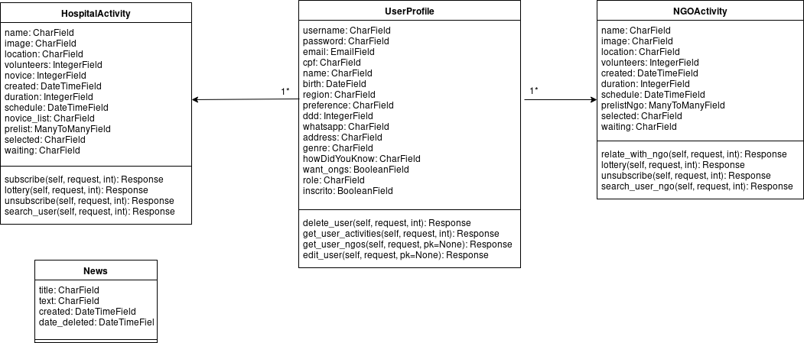

# Relatório de Fechamento de Projeto
# 1. Fechamento da Sprint 
# 2. Burndown
# 3. Velocity
# 4. Quadro de Horas
# 5. Quadro de conhecimento
# 6. Riscos
# 7. Arquitetura 
Para execução do projeto foi utilizada arquitetura Django REST Framework para o backend, a qual busca modularizar a interação com diferentes funcionalidades da API. Cada funcionalidade, deve ter uma estrutura que também é herdada da estrutura do Django, contendo uma ‘model’ e uma ‘view’ em cada funcionalidade, em diferentes endpoints, gerando módulos que podem ser retirados e adicionados sem uma alteração na estrutura do projeto.
# 7.1 Diagram de Classe
Esta seção busca ilustrar as versões: inicial e final, a fim de visibilizar as mudanças no projeto.
<h2>Versão inicial</h2>

<h2>Versão Final</h2>

[Clique aqui para dar zoom](https://i.imgur.com/xA1euNq.png)

# 7.2 Benchmark
Nesta seção são apresentados valores das medições das principais funcionalidades da aplicação.

<h2>
 -> Benchmark versão inicial
</h2>

<h3>
Funcionalidade: Login
</h3>

|Medição    |	 Tempo Inicial|	Tempo Final|	Tempo de Execução|	Dados Recebidos (KB/s)|	Dados Enviados (KB/s)|	Uso de Memória (em MB)|	Consumo de CPU|
|-----------|-----------------|------------|---------------------|------------------------|----------------------|------------------------|---------------|
|1	        |00:01:46	      |00:01:48	   |0:00:02              |	3.4                   |	2.7                  |178.2                   |	11,00%        |
|2	        |00:00:27	      |00:00:28    |0:00:01              |	2.7                   |	3.7                  |178.1                   |	13,50%        |
|3	        |00:00:35	      |00:00:36    |0:00:01              |	2.8                   |	3.5                  |183.3                   |	7,80%         |

<h3>
Funcionalidade: Câmera
</h3>

|Medição    |	 Tempo Inicial|	Tempo Final|	Tempo de Execução|	Dados Recebidos (KB/s)|	Dados Enviados (KB/s)|	Uso de Memória (em MB)|	Consumo de CPU|
|-----------|-----------------|------------|---------------------|------------------------|----------------------|------------------------|---------------|
|1	        |0:00:44	      |0:00:47     |0:00:03              |	-                     |	-                    |256.4                   |	15,90%        |
|2	        |00:03:04	      |00:03:08    |0:00:04              |	-                     |	-                    |258.4                   |	17,30%        |
|3	        |00:01:51	      |00:01:56    |0:00:05              |	-                     |	-                    |264.4                   |	25,60%        |

<h3>
Funcionalidade: Início da Aplicação
</h3>

|Medição    |	 Tempo Inicial|	Tempo Final|	Tempo de Execução|	Dados Recebidos (KB/s)|	Dados Enviados (KB/s)|	Uso de Memória (em MB)|	Consumo de CPU|
|-----------|-----------------|------------|---------------------|------------------------|----------------------|------------------------|---------------|
|1	        |0:00:03	      |0:00:05     |0:00:02              |	-                     |	-                    |145.1                   |	16,60%        |
|2	        |00:00:01	      |00:00:04    |0:00:03              |	-                     |	-                    |142.9                   |	26,00%        |
|3	        |00:00:01	      |00:00:04    |0:00:03              |	-                     |	-                    |145.2                   |	22,70%        |

<h3>
Funcionalidade: Cadastro
</h3>

|Medição    |	 Tempo Inicial  |	Tempo Final    |	Tempo de Execução  |	Dados Recebidos (KB/s)|	Dados Enviados (KB/s)|	Uso de Memória (em MB)|	Consumo de CPU|
|-----------|-----------------|----------------|---------------------|------------------------|----------------------|------------------------|---------------|
|1          |	0:01:08	        |0:01:10         |	0:00:02            |	3.6                   | 4.5                  |	191	                  | 6.3%          |
|2	        |00:00:58	        |00:01:00        |	0:00:02            |	3.6                   |	4.4	                 |196.4                   | 5.7%          |
|3	        |00:00:43         |00:00:46	       |  0:00:03            |	3.8                   |	4.1	                 | 192.2	                | 6.1%          |

<h2>
 -> Benchmark Versão Final
</h2>

<h3>
Funcionalidade: Cadastro
</h3>

|Medição    |	 Tempo Inicial  |	Tempo Final    |	Tempo de Execução  |	Dados Recebidos (KB/s)|	Dados Enviados (KB/s)|	Uso de Memória (em MB)|	Consumo de CPU|
|-----------|-----------------|----------------|---------------------|------------------------|----------------------|------------------------|---------------|
|1          |	0:10:08         |	0:10:09        |	0:00:01            |	1.7                   |	1.7                  |	134	                  | 6,00%         |
|2          |	00:05:34	      | 00:05:35       |  0:00:01	           |  1.6                   |	1.8	                 |  152.5                 |	5.8%          |
|3          |	00:07:22        |	00:07:24       |	0:00:02	           |  1.9                   |	2,00                 |	144.9                 |	5.9%          |

<h3>
Funcionalidade: Cadastrar na atividade
</h3>

|Medição    |	 Tempo Inicial  |	Tempo Final    |	Tempo de Execução  |	Dados Recebidos (KB/s)|	Dados Enviados (KB/s)|	Uso de Memória (em MB)|	Consumo de CPU|
|-----------|-----------------|----------------|---------------------|------------------------|----------------------|------------------------|---------------|
|1          |	0:10:08         |	0:10:09        |	0:00:01            |	1.7                   |	1.7                  |	134	                  | 6,00%         |
|2          |	00:05:34	      | 00:05:35       |  0:00:01	           |  1.6                   |	1.8	                 |  152.5                 |	5.8%          |
|3          |	00:07:22        |	00:07:24       |	0:00:02	           |  1.9                   |	2,00                 |	144.9                 |	5.9%          |

<h3>
Funcionalidade: Cancelar inscrição
</h3>

|Medição     |	 Tempo Inicial  |	Tempo Final    |	Tempo de Execução  |	Dados Recebidos (KB/s)|	Dados Enviados (KB/s)|	Uso de Memória (em MB)|	Consumo de CPU|
|------------|------------------|----------------|---------------------|------------------------|----------------------|------------------------|---------------|
| 1 	       | 00:14:19         |	00:14:20       |	0:00:01            |	2.5                   |	1.7                  |	140                   |	6.8%|
|2|	00:18:01	|00:18:02	|0:00:01	|2.5	|1.7	|142.1	|6.5%|
|3|	00:03:24|	00:03:25|	0:00:01	|2.5|	1.8	|133.3	|6.7%|

<h3>
Funcionalidade: Visualizar Perfil
</h3>

|Medição     |	 Tempo Inicial  |	Tempo Final    |	Tempo de Execução  |	Dados Recebidos (KB/s)|	Dados Enviados (KB/s)|	Uso de Memória (em MB)|	Consumo de CPU|
|------------|------------------|----------------|---------------------|------------------------|----------------------|------------------------|---------------|
|1           |	00:19:02        |	00:19:04       |	0:00:02            |	2.8                   |	4.1                  |	131.8                 | 5.8%          |
|2|	00:03:24|	00:03:25|	0:00:01|	2.5|	4.3	|130| 6.5%|
|3|	00:03:55|	00:03:57|	0:00:02	|2.9	|4.1	|132.1 |6.4%|

<h3>
Funcionalidade: Editar Perfil
</h3>

|Medição     |	 Tempo Inicial  |	Tempo Final    |	Tempo de Execução  |	Dados Recebidos (KB/s)|	Dados Enviados (KB/s)|	Uso de Memória (em MB)|	Consumo de CPU|
|------------|------------------|----------------|---------------------|------------------------|----------------------|------------------------|---------------|
|1|	00:00:34|	00:00:35|	0:00:01|	4.7|	4.2|	142.7	|5.5%|
|2|	00:01:22|	00:01:23|	0:00:01	|4.7	|4.3|	143	|6.9%|
|3|	00:07:13|	00:07:15|	0:00:02|	4.7|	4.3|	147.6	|6.2%|

<h3>
Funcionalidade: Tirar Foto
</h3>

|Medição     |	 Tempo Inicial  |	Tempo Final    |	Tempo de Execução  |	Dados Recebidos (KB/s)|	Dados Enviados (KB/s)|	Uso de Memória (em MB)|	Consumo de CPU|
|------------|------------------|----------------|---------------------|------------------------|----------------------|------------------------|---------------|
|1|	00:02:42|	00:02:45|	0:00:03	|0,00|	0,00|	128.6|
|2|	00:06:09|	00:06:14|	0:00:05	|0,00|	0,00	|129.1|
|3	|00:13:02	|00:13:05	|0:00:03	|0,00	|0,00	|130.1|

<h3>
Funcionalidade: Selecionar Foto da Galeria
</h3>

|Medição     |	 Tempo Inicial  |	Tempo Final    |	Tempo de Execução  |	Dados Recebidos (KB/s)|	Dados Enviados (KB/s)|	Uso de Memória (em MB)|	Consumo de CPU|
|------------|------------------|----------------|---------------------|------------------------|----------------------|------------------------|---------------|
|1|	00:01:12|	00:01:14|	0:00:02|	0,00|	0,00|	134|	11.3%|
|2|	00:07:51|	00:07:53|	0:00:02|	0,00|	0,00|	151.2|	11.8%|
|3|	00:14:22|	00:14:25|	0:00:03|	0,00|	0,00|	148.3|	11.4%|

<h2>
Funcionalidade: Logout
</h2>

|Medição     |	 Tempo Inicial  |	Tempo Final    |	Tempo de Execução  |	Dados Recebidos (KB/s)|	Dados Enviados (KB/s)|	Uso de Memória (em MB)|	Consumo de CPU|
|------------|------------------|----------------|---------------------|------------------------|----------------------|------------------------|---------------|
|1|	00:21:23|	00:21:24|	0:00:01|	0,00|	0,00|	188.1|	8.9%|
|2|	00:16:48|	00:16:51|	0:00:03|	0	|0	|189.9	|9.1%|
|3|	00:17:11|	00:17:13|	0:00:02|	0	|0	|191.0|	10.1%|
## 8. EVM
## 9. Retrospectiva do projeto
