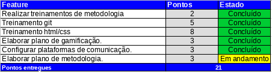
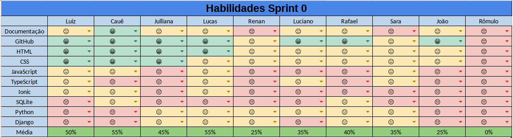

# Resultados da Sprint 0  
------

[1. Indicadores de Qualidade do Processo](#1-indicadores-de-qualidade-do-processo)

* [1.1 Fechamento da _Sprint_](#11-fechamento-da-sprint)
* [1.2 Quadro de Conhecimento](#12-quadro-de-conhecimento)
* [1.3 Revisão](#13-revisao)
* [1.4 Retrospectiva](#14-retrospectiva)

------

## 1. Indicadores de Qualidade do Processo

### 1.1 Fechamento da _Sprint_

A tabela a seguir mostra o resultado da _Sprint_.

 Todas as histórias planejadas para a _sprint_ foram concluídas, exceto o Plano de Metodologia, que ficou com pendências.

### 1.2 Quadro de Conhecimento

O quadro acima mostra nível de conhecimento inicial dos membros em relação às tecnologias que serão utilizadas no projeto.

### 1.3 Revisão

#### 1.3.1 Pontos Positivos
* A equipe de desenvolvimento cumpriu o planejado para a _Sprint_;
* Os membros participaram ativamente das atividades propostas;
* As plataformas de comunicação contribuíram para um melhor entrosamento entre os membros;
* A equipe de desenvolvimento aceitou e cumpriu o desafio lançado durante o treinamento de _frontend_, e;
* A equipe aceitou o plano de gamificação.

### 1.3.2 Pontos Negativos
* Apesar das plataformas de comunicação, a equipe de desenvolvimento teve dificuldade com a interação presencial;
* Falta de organização, e;
* Dificuldade em gerenciar o tempo.

### 1.4 Retrospectiva
Na retrospectiva foram apontadas as seguintes melhorias:
* Melhorar organização, e;
* Melhorar a interação entre os membros.

Como solução para essas melhorias, nas próximas _Sprints_ serão feitas _dailies_ presenciais e será usada uma ferramenta de gerenciamento de tempo para melhorar a organização.
