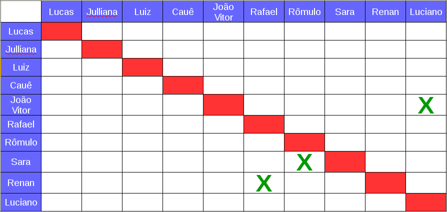

# Planejamento da Sprint 1  

**Data de Início:** 14/03/2018  

**Data de Término:** 21/03/2018

**Duração:** Uma Semana

**Pontos Planejados**: 34

**Pontos Adicionados**: 0

**Pontos Totais**: 34

-------

[1. Pareamento](#1-pareamento)

[2. Mudanças](#2-mudanças)

[3. Priorização](#3-priorizacao)

[4. Features da Sprint](#4-features-da-sprint)

-------
## 1. Pareamento

## 2. Mudanças
Algumas mudanças foram feitas para melhorar a interação dos membros e ajudar no gerenciamento de horas. As mudanças realizadas foram:
* As _dailies_ agora, além das remotas, serão feitas presencialmente às 12hrs nas segundas e quintas-feiras.
* Foi aplicado o uso da ferramenta TopTracker para o gerenciamento do tempo.

## 3. Priorização
A priorização das features foi feita na necessidade de documentar o projeto e criar uma visão uniforme do que será feito antes de
começar a fase de criação de código.

## 4. Features da _Sprint_
* <a href="https://github.com/fga-gpp-mds/2018.1-Lacos-da-Alegria/issues/14">[#14]Realizar o treinamento de arquitetura de software</a>
* <a href="https://github.com/fga-gpp-mds/2018.1-Lacos-da-Alegria/issues/16">[#16]Elaborar a estrutura analítica do projeto</a>
* <a href="https://github.com/fga-gpp-mds/2018.1-Lacos-da-Alegria/issues/17">[#17]Elaborar o termo de abertura do projeto</a>
* <a href="https://github.com/fga-gpp-mds/2018.1-Lacos-da-Alegria/issues/19">[#19]Elaborar o diagrama de fishbone</a>
* <a href="https://github.com/fga-gpp-mds/2018.1-Lacos-da-Alegria/issues/20">[#20]Elaborar o documento de arquitetura<a>
* <a href="https://github.com/fga-gpp-mds/2018.1-Lacos-da-Alegria/issues/21">[#21]Elaborar o documento de visão</a>
* <a href="https://github.com/fga-gpp-mds/2018.1-Lacos-da-Alegria/issues/22">[#22]Elaborar o guia de estilo</a>
