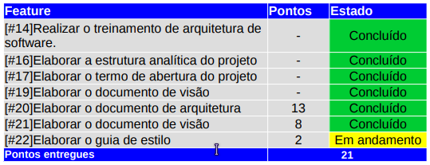
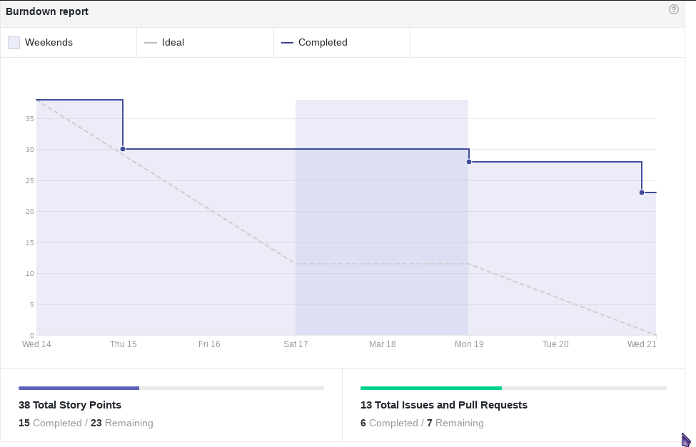
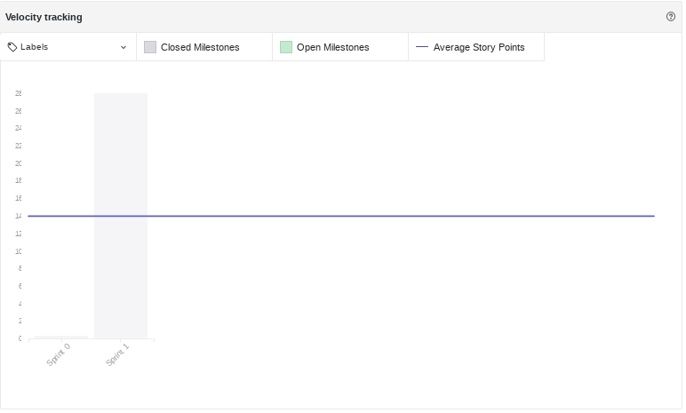

------

[1. Indicadores de Qualidade do Processo](#1-indicadores-de-qualidade-do-processo)

* [1.1 Fechamento da _Sprint_](#11-fechamento-da-sprint)
* [1.2 Agenda de Pareamento](#12-agenda-de-pareamento)
* [1.3 _Burndown_](#13-burndown)
* [1.4 Gráfico de _commits_](#14-grafico-de-commits)
* [1.5 _Velocity_](#15-velocity)
* [1.6 Quadro de Conhecimento](#16-quadro-de-conhecimento)
* [1.7 Melhorias em relação a _Sprint_ 0](#17-melhorias-em-relação-a-sprint-0)
* [1.8 Retrospectiva](#16-retrospectiva)

[2. Indicadores de Qualidade do Código](#2-indicadores-de-qualidade-do-código)

[3. EVM](#3-evm)
* [3.1 Dados](#31-dados)
* [3.2 Gráficos](#32-gr%C3%A1ficos)

[4. Análise do _Scrum Master_](#4-análise-do-scrum-master)  

------

## 1. Indicadores de Qualidade do Processo

### 1.1 Fechamento da _Sprint_

Todas as histórias que foram planejadas para a _Sprint_ 01 foram concluídas, com excessão do Guia de Estilo, que ficará como dívida técnica para a próxima _Sprint_.

### 1.3 _Burndown_

No gráfico é possível perceber um longo período em que pontos não foram entregues. Este fato não reflete a realidade, pois os membros estavam produzindo durante esse período. Isto acontece, por que uma história só é considerada pronta depois de entregue completamente.

### 1.4 Gráfico de _commits_

### 1.5 _Velocity_

Como as histórias da _Sprint_ 0 não foram pontuadas, o primeiro _Velocity_ da equipe é este, com 7,5 pontos.

### 1.7 Melhorias em relação a _Sprint_ 0

Em relação a _Sprint_ 0, nessa _Sprint_ a organização do time melhorou, apesar de ainda não estar no ideal. O uso da ferramenta TopTracker para gerenciar o tempo e dos canais do Slack ajudaram bastante na melhora dessa organização.

### 1.00 Revisão da _Sprint_

Durante a Revisão da _Sprint_ foram levantados os seguintes problemas que ocorreram na mesma:  
* Os desenvolvedores se sentiram "perdidos" na arquitetura da solução proposta. Para resolver esse problema foi feita uma reunião com o cliente e a arquiteta.
* Houveram desencontros de algumas informações, isso ocorreu por causa diferentes opiniões entre os gerentes. Para resolver esse problema foi feita uma reunião para criar uma visão comum entre os membros.
* Os membros de desenvolvimento não tiveram informações suficientes para elaborar o Guia de Estilo e por isso este não foi entregue nesta _Sprint_.
* Alguns membros tiveram dificuldades para elaborar os documentos no formato _markdown_ e também para fazer o upload no Github.

#### Melhorias

* 
 <b>Começar a entregar as histórias mais cedo para melhorar o <i>burndown</i></b>: Na tentativa de resolver esse problema foi criada a agenda de pareamentos, foi uma iniciativa que funcionou parcialmente e resultou em um gráfico mais coeso em relação a iteração anterior.

* 
 <b>Separar os pareamentos por horários disponíveis dos membros</b>: Não é possível priorizar que as duplas sejam formadas por um pareamento por horário livre devido a nossa política de pareamentos para disseminar o conhecimento entre os membros do grupo, porém não é necessário que o desenvolvimento seja sempre feito durante os pareamentos.

* 
 <b>Ter um maior controle dos horários em que os pareamentos serão realizados</b>: Assim como no item anterior a agenda de pareamentos foi adotada para mitigar o problema de horários da equipe.

* 
 <b>Seguir mais a metodologia ágil</b>: Alguns rituais do ágil não foram do ágil não foram seguidos ou ignorados durante a primeira <i>sprint</i> como as reuniões diárias e planejamento da <i>sprint</i>.
  O planejamento da <i>sprint</i> foi feito com todo o time, incluindo a derivação de algumas histórias e atribuição de pontuação à elas. O <i>daily meeting</i> foi feito diariamente pelo <i>Telegram</i>, esse foi um problema apontado durante a <i>sprint</i>, que não foi muito esclarecedor do que as duplas estavam fazendo, bem como suas dificuldades.

* 
 <b>Sprint ser mais organizada</b>: Como a equipe de GPP não estava presente e nenhum dos membros de MDS tinham experiência com a metodologia ágil a equipe de MDS relatou desorganização da <i>sprint</i>. Com a volta dos membros de GPP para o projeto, observou-se que a <i>sprint 1</i>, em comparação com a anterior, foi mais organizada tanto em termos de planejamento quanto de execução.

### 1.8 Retrospectiva

## 2. Indicadores de Qualidade do Código

As métricas de qualidade de código da <i>sprint</i> estão especificadas e analisadas na página <a href="https://github.com/fga-gpp-mds/2017.2-Receituario-Medico/wiki/M%C3%A9tricas-de-C%C3%B3digo-Sprint-1">Métricas da <i>sprint</i> 1</a>.

## 3. EVM

#### 3.1 Dados

#### 3.2 Gráficos

#### 3.3 Análise da EVM

Ao final dessa <i>sprint</i> estamos com o projeto tranquilo em relação aos indicadores da EVM. Neles podemos observar que ao término dessa <i>sprint</i> agregamos valor ao cliente igual ao planejado inicialmente.

A Variação do Prazo e o Índice de Desempenho de Prazo demonstram que estamos no prazo em relação ao prazo planejado do projeto, ou seja, estamos com a execução do projeto ocorrendo de forma tranquila em relação ao que foi planejado para a release.

### 4. Análise do _Scrum Master_

Durante a <i>sprint 1</i> o time se mostrou capaz de realizar grande parte das atividades atribuidas. Todas as histórias foram feitas e, ao contrário da iteração anterior, novas funcionalidades foram integradas ao sistema.

Dos pontos positivos da <i>sprint</i> vale destacar algumas como o planejamento conjunto da <i>sprint</i>, segmentação do trabalho durante a <i>sprint</i>, o funcionamento parcial da agenda de pareamento, o amadurecimento da equipe e o aprendizado das tecnologias e das metodologias utilizadas.

Mesmo que todas as histórias tenham sido entregues, algumas atividades características do <i>Scrum</i>, como o <i>daily meeting</i>, deixaram a desejar, muito pelo fato da dificuldade do encontro presencial e este ser feito via <i>Telegram</i>. Outros pontos negativos foram a dependência de alguns membros em relação ao par no pareamento, dificuldade de seguir política de <i>branches</i> e principalmente a dificuldade de comunicação entre os membros da equipe e com o cliente. Estes dois ultimos são os mais prioritários.

