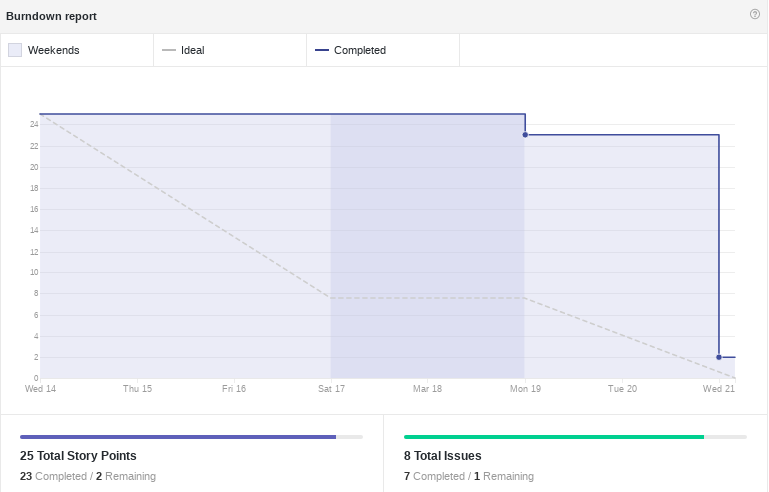

------

[1. Indicadores de Qualidade do Processo](#1-indicadores-de-qualidade-do-processo)

* [1.1 Fechamento da _Sprint_](#11-fechamento-da-sprint)
* [1.2 _Burndown_](#13-burndown)
* [1.3 Gráfico de _commits_](#14-grafico-de-commits)
* [1.4 _Velocity_](#15-velocity)
* [1.5 Melhorias em relação a _Sprint_ 0](#17-melhorias-em-relação-a-sprint-0)
* [1.6 Revisão](#16-revisao-da-sprint)
* [1.7 Retrospectiva](#17-retrospectiva)

[2. Análise do _Scrum Master_](#2-análise-do-scrum-master)  

------

## 1. Indicadores de Qualidade do Processo

### 1.1 Fechamento da _Sprint_

Todas as histórias que foram planejadas para a _Sprint_ 01 foram concluídas, com excessão do Guia de Estilo, que ficará como dívida técnica para a próxima _Sprint_.

### 1.2 _Burndown_

No gráfico é possível perceber um longo período em que pontos não foram entregues. Este fato não reflete a realidade, pois os membros estavam produzindo durante esse período. Isto acontece, por que uma história só é considerada pronta depois de entregue completamente.

### 1.3 Gráfico de _commits_

### 1.4 _Velocity_

Como as histórias da _Sprint_ 0 não foram pontuadas, o primeiro _Velocity_ da equipe é este, com 7,5 pontos.

### 1.5 Melhorias em relação a _Sprint_ 0

Em relação a _Sprint_ 0, nessa _Sprint_ a organização do time melhorou, apesar de ainda não estar no ideal. O uso da ferramenta TopTracker para gerenciar o tempo e dos canais do Slack ajudaram bastante na melhora dessa organização.

### 1.6 Revisão da _Sprint_

Durante a Revisão da _Sprint_ foram levantados os seguintes problemas que ocorreram na mesma:  
* Os desenvolvedores se sentiram "perdidos" na arquitetura da solução proposta. Para resolver esse problema foi feita uma reunião com o cliente e a arquiteta.
* Houveram desencontros de algumas informações, isso ocorreu por causa diferentes opiniões entre os gerentes. Para resolver esse problema foi feita uma reunião para criar uma visão comum entre os membros.
* Os membros de desenvolvimento não tiveram informações suficientes para elaborar o Guia de Estilo e por isso este não foi entregue nesta _Sprint_.
* Alguns membros tiveram dificuldades para elaborar os documentos no formato _markdown_ e também para fazer o upload no Github.

### 1.7 Retrospectiva

### 2. Análise do _Scrum Master_

Durante a iteração o time se mostrou mais maduro e houve uma melhora em relação a interação do time que se mostrou disposto a sanar dúvidas e a ajudar um ao outro.

A falta de estimativas de algumas histórias foi um erro cometido no planejamento dessa _Sprint_, pois pode prejudicar o planejamento das próximas. Mas, com esse risco identificado, o time se comprometerá a estimas todas as histórias futuras.

O uso de ferramentas para o gerenciamento de tempo se torna um importante aliado para as futuras _Sprints_, pois com ela é possível perceber onde estão os gargalos do projeto e atacá-los.
