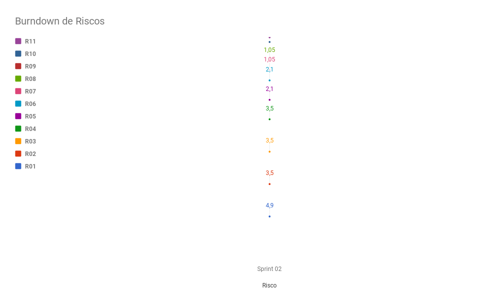

# Planejamento da Sprint 02

**Data de Início**: 21/03/2018

**Data de Término**: 28/03/2018

**Duração**: Uma Semana

**Pontos Planejados**: 52

**Pontos Adicionados**: 2

**Pontos Totais**: 54

-------
[1. Pareamento](#1-pareamento)

[2. Priorização](#2-priorização)

[3. Mudanças](#3-mudanças)

[4. Burndown de Riscos](#4-burndown-de-riscos)

[5. Histórias da _Sprint_](#5-features-da-sprint)

-------

## 1. Pareamento

## 2. Priorização

A priorização das histórias da _Sprint_ foi baseado no fato de que é necessário gerar a documentação para garantir o processo e para gerar um comum acordo entre os membros sobre o que será desenvolvido.

## 3. Mudanças

Como relatado na [Retrospectiva da _Sprint_ 01](../sprint01/results.md), um dos pontos a serem melhorados é o trabalho em grupo. Assim, foi definido que um membro da gerência seria responsável por acompanhar e auxiliar cada pareamento do Time de Desenvolvimento. Foi definido que o membros Cauê e Julliana seriam responsáveis por auxiliar a Sara, Renan e o Luciano e o membro Lucas seria responsável pela dupla Rômulo e Rafael.

Outra mudança que ocorreu durante essa _Sprint_ foi que os eventos de Planejamento, Revisão e Retrospectiva serão feitos remotamente, pois o time não possui horário em comum para fazê-los pessoalmente. A Daily que acontecia presencialmente às quintas-feiras também será feita remotamente, por que o time percebeu que era um _overhead_, por ser muito próximo do Planejamento da _Sprint_.

## 4. Burndown de Riscos

A  tabela a seguir lista todos os riscos que foram identificados para essa _Sprint_, a probabilidade deles ocorrerem, quantos dias serão perdidos caso o risco ocorra e a exposição ao risco que é calculado multiplicando a probabilidade do risco pelo tamanho da perda.

| # | Descrição | Probabilidade do Risco |Tamanho da Perda (dias)|Exposição ao Risco
| :--- | :------------- | :------------- | :------------- | :------------- |
| 01 | Incompatibilidade de horários para reuniões  | 70%  | 7  | 4,9  |
| 02 | Features má pontuadas  | 50%  | 7 | 3,5  |
| 03 | Baixa produtividade  | 50%  | 7  | 3,5  |
| 04 | Mais pontos planejados do que o time é capaz de entregar  | 50%  | 7  | 3,5  |
| 05 | Dificuldades com a tecnologia de desenvolvimento  | 70%  | 3  | 2,1  |
| 06 | Erros na implementação de Features  | 30%  | 7  |  2,1 |
| 07 | Features mal documentadas   | 15%  | 7  | 1,05  |
| 08 | Quebra ou furto de equipamentos da equipe   | 15%   | 7 | 1.05  |
| 09 |  Desistência de algum membro       | 15%    | 7 | 1.05|
| 10 | Problemas na configuração do ambiente de desenvolvimento  | 50%  |  2 | 1  |
| 11 | Dificuldade de se reunir com o cliente   | 50%  | 1  | 0,5  |
|   |   |   | Exposição:  | 24,25  |

Abaixo é mostrado o _Burndown_ de riscos das _Sprints_ em que foi em que ele foi levantado.

## 5. Features da _Sprint_

* <a href="https://github.com/fga-gpp-mds/2018.1-Lacos-da-Alegria/issues/22">[#22]Elaborar o guia de estilo</a>
* <a href="https://github.com/fga-gpp-mds/2018.1-Lacos-da-Alegria/issues/31">[#31]Treinamento de Javascript/Typescript</a>
* <a href="https://github.com/fga-gpp-mds/2018.1-Lacos-da-Alegria/issues/32">[#32]Treinamento de Docker e Docker Compose</a>
* <a href="https://github.com/fga-gpp-mds/2018.1-Lacos-da-Alegria/issues/33">[#33]Treinamento de AngularJS e Ionic</a>
* <a href="https://github.com/fga-gpp-mds/2018.1-Lacos-da-Alegria/issues/34">[#34]Evolução do Protótipot</a>
* <a href="https://github.com/fga-gpp-mds/2018.1-Lacos-da-Alegria/issues/35">[#35]Especificação Suplementart</a>
* <a href="https://github.com/fga-gpp-mds/2018.1-Lacos-da-Alegria/issues/36">[#36]Definir e configurar métricas</a>
* <a href="https://github.com/fga-gpp-mds/2018.1-Lacos-da-Alegria/issues/37">[#37]Burndown de Risco</a>
* <a href="https://github.com/fga-gpp-mds/2018.1-Lacos-da-Alegria/issues/38">[#38]EVM</a>
* <a href="https://github.com/fga-gpp-mds/2018.1-Lacos-da-Alegria/issues/39">[#39]Definir criterios de aceitação e descrição das issues</a>
* <a href="https://github.com/fga-gpp-mds/2018.1-Lacos-da-Alegria/issues/40">[#40]Fazer e padronizar Roadmaps</a>
* <a href="https://github.com/fga-gpp-mds/2018.1-Lacos-da-Alegria/issues/41">[#41]Ajustar o quadro de conhecimento com a gamificação</a>
