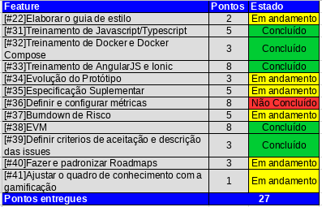
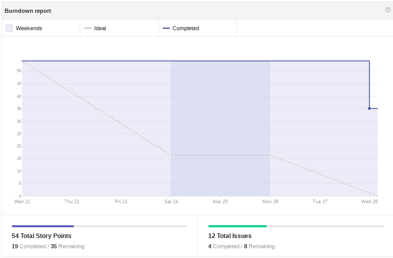
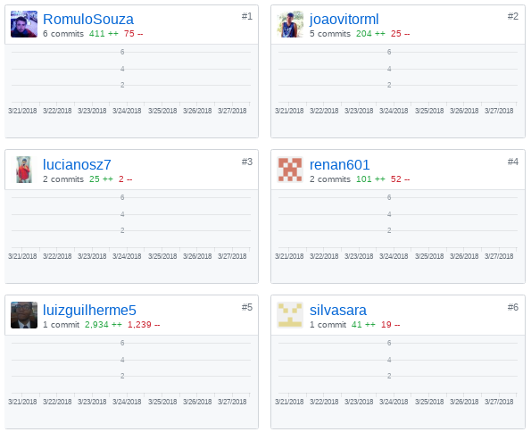
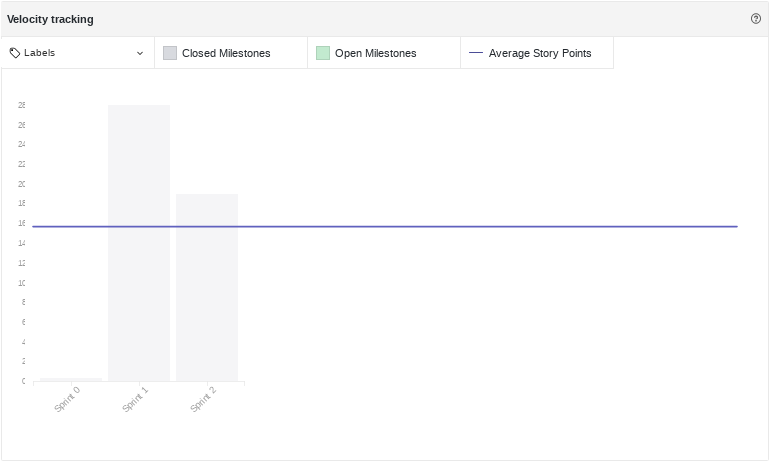
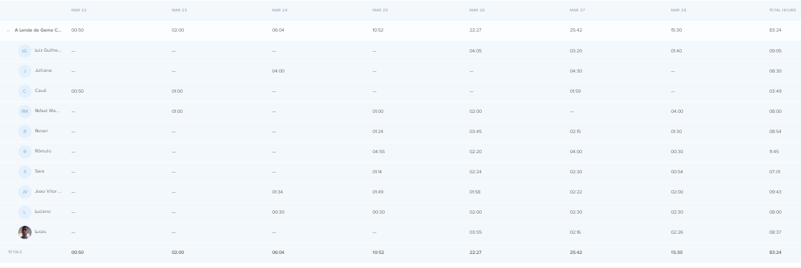
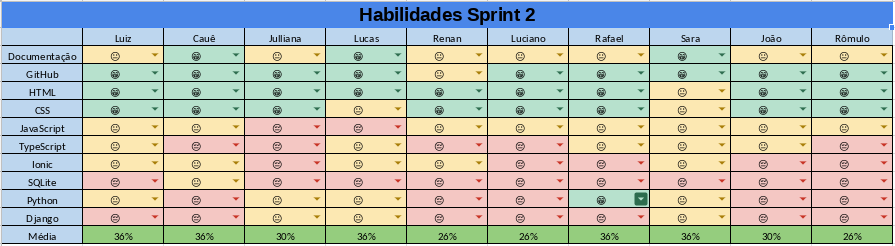
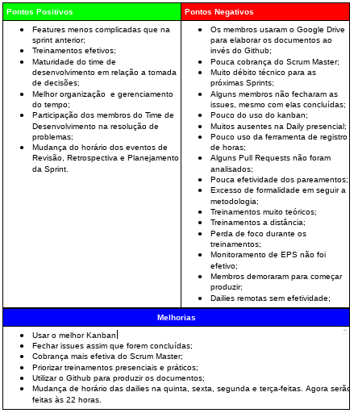

# Resultados da Sprint 02
------

[1. Indicadores de Qualidade do Processo](#1-indicadores-de-qualidade-do-processo)

* [1.1 Fechamento da _Sprint_](#11-fechamento-da-sprint)
* [1.2 _Burndown_](#12-burndown)
* [1.3 Gráfico de _commits_](#13-grafico-de-commits)
* [1.4 _Velocity_](#14-velocity)
* [1.5 Quadro de Horas](#15-quadro-de-horas)
* [1.6 Quadro de Conhecimento](#16-quadro-de-conhecimento)
* [1.7 Melhorias em relação a _Sprint_ 0](#17-melhorias-em-relação-a-sprint-0)
* [1.8 Revisão](#18-revisao-da-sprint)
* [1.9 Retrospectiva](#19-retrospectiva)

[2. Análise do _Scrum Master_](#2-análise-do-scrum-master)  

------

## 1. Indicadores de Qualidade do Processo

### 1.1 Fechamento da _Sprint_

Dos 54 pontos planejados, apenas 19 foram entregues. Isso ocorreu, pois muitos membros não abriram _Pull Request_ para entregarem
os documentos entregues, não seguindo a definição de "pronto".

### 1.2 _Burndown_

No gráfico é possível perceber um longo período em que pontos não foram entregues que aconteceu porque, apesar das _issues_ estarem prontas muito antes, elas foram só foram fechadas no último dia da _Sprint_.

### 1.3 Gráfico de _commits_

### 1.4 _Velocity_

Apesar da pouca entrega de pontos o velocity subiu de 14 para 16 pontos.

### 1.5 Quadro de Horas

### 1.6 Quadro de Conhecimento

Em relação à _Sprint_ anterior é possível houve uma melhoria nos conhecimentos de documentação, Github, e nas linguagens. Essas melhorias
ocorreram,principalmente, por causa da contínua entrega de documentos e por causa dos treinamentos que ocorreram.

### 1.7 Revisão da _Sprint_

Durante a Revisão da _Sprint_ foram levantados os seguintes problemas que ocorreram na mesma:  
* A equipe relatou erros no Docker durante a treinamento
* O protótipo é feito online e por isso não tem como registrar no Github, para resolver esse problema foi sugerido
tirar _printscreens_ e criar um documento no Github.
* Durante a _Sprint_ o time ficou disperso o que acarretou em demora para sanar dúvidas importantes. Então foram
feitas reuniões para resolver esse problema.

### 1.8 Retrospectiva

### 2. Análise do _Scrum Master_

Essa foi uma _Sprint_ um pouco contubarda por causa do pouco monitoramento de EPS. A produção de documentos
no Google Drive foi um grande problema para a Sprint, pois foram entregues poucos pontos por causa do retrabalho de passar tudo que foi escrito
para o _markdown_.

Apesar disso foi possível perceber uma maturidade maior com relação ao Time de Desenvolvimento que tomou decisões sem precisar do apoio dos gerentes.

Também é possível perceber que a produtidade do time está crescendo e isto pode ser observado com o aumento do _velocity_ e com as quantidade de horas trabalhadas em torno de 10hrs.
