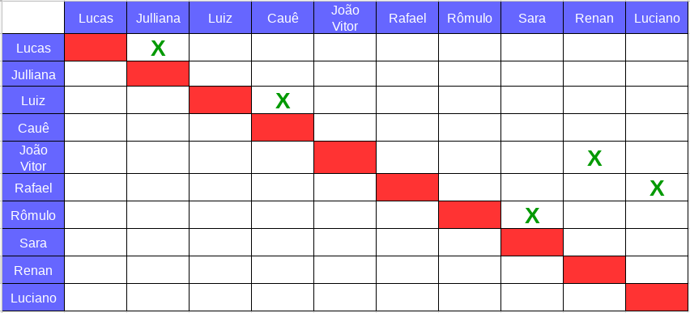
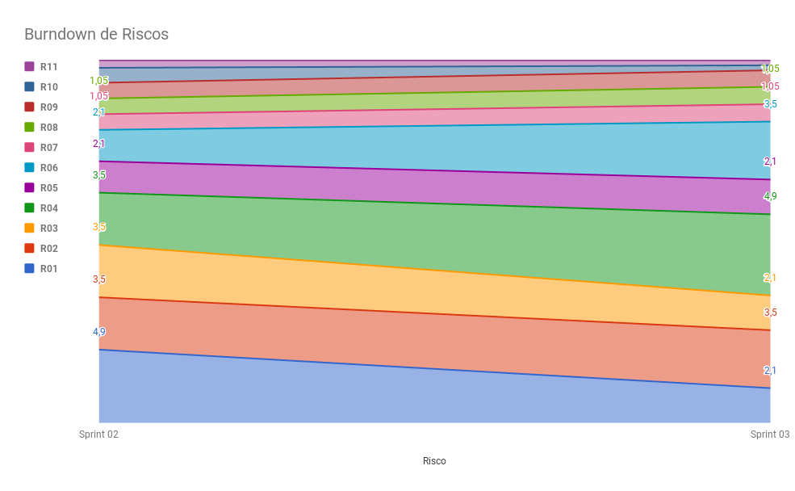

# Planejamento da Sprint 3  

**Data de Início:** 28/03/2018  

**Data de Término:** 04/04/2018

**Duração:** Uma Semana

**Pontos Planejados**: 53

**Pontos Adicionados**: 26

**Pontos Totais**: 79

-------

[1. Pareamento](#1-pareamento)

[2. Mudanças](#2-mudanças)

[3. Priorização](#3-priorizacao)

[4. Burndown de Riscos](#4-burndown-de-riscos)

[5. Histórias da _Sprint_](#5-histórias-da-sprint)

-------
## 1. Pareamento

## 2. Mudanças
As _dailies_ de segunda, terça, quinta e sexta-feiras, agora, ocorrerão em uma reunião remota às 22 horas. Nos demais dias ocorrerão usando um _bot_ integrado ao Slack. Essa mudança está sendo feita porque as dailies feitas usando o _bot_ não estavam sendo efetivas.

## 3. Priorização
A priorização das features foi feita na necessidade de refatorar os documentos e entender qual o nível de conhecimento do Time de Desenvolvimento com relação às linguagens e ferramentas que serão utilizadas.

## 4. Burndown de Riscos

A  tabela a seguir lista todos os riscos que foram identificados para essa _Sprint_, a probabilidade deles ocorrerem, quantos dias serão perdidos caso o risco ocorra e a exposição ao risco que é calculado multiplicando a probabilidade do risco pelo tamanho da perda.

| # | Descrição | Probabilidade do Risco |Tamanho da Perda (dias)|Exposição ao Risco
| :--- | :------------- | :------------- | :------------- | :------------- |
| 01 | Incompatibilidade de horários para reuniões  | 30%  | 7  | 2,1  |
| 02 | Features má pontuadas  | 50%  | 7 | 3,5  |
| 03 | Baixa produtividade  | 30%  | 7  | 2,1  |
| 04 | Mais pontos planejados do que o time é capaz de entregar  | 70%  | 7  | 4,9  |
| 05 | Dificuldades com a tecnologia de desenvolvimento  | 70%  | 3  | 2,1  |
| 06 | Erros na implementação de Features  | 50%  | 7  |  3,5 |
| 07 | Quebra ou furto de equipamentos da equipe   | 15%   | 7 | 1.05  |
| 08 | Features mal documentadas   | 15%  | 7  | 1,05  |
| 09 |  Desistência de algum membro       | 15%    | 7 | 1.05|
| 10 | Problemas na configuração do ambiente de desenvolvimento  | 50%  |  2 | 1  |
| 11 | Dificuldade de se reunir com o cliente   | 30%  | 1  | 0,3  |
|   |   |   | Exposição:  | 22,65  |

Abaixo é mostrado o _Burndown_ de riscos das _Sprints_ em que foi em que ele foi levantado.

## 5. Features da _Sprint_
* <a href="https://github.com/fga-gpp-mds/2018.1-Lacos-da-Alegria/issues/22">[#22]Elaborar o guia de estilo</a>
* <a href="https://github.com/fga-gpp-mds/2018.1-Lacos-da-Alegria/issues/34">[#34]Evolução do Protótipo</a>
* <a href="https://github.com/fga-gpp-mds/2018.1-Lacos-da-Alegria/issues/35">[#35]Especificação Suplementar</a>
* <a href="https://github.com/fga-gpp-mds/2018.1-Lacos-da-Alegria/issues/36">[#36]Definir e configurar métricas</a>
* <a href="https://github.com/fga-gpp-mds/2018.1-Lacos-da-Alegria/issues/37">[#37]Burndown de Risco<a>
* <a href="https://github.com/fga-gpp-mds/2018.1-Lacos-da-Alegria/issues/40">[#40]Fazer e padronizar Roadmaps<a>
* <a href="https://github.com/fga-gpp-mds/2018.1-Lacos-da-Alegria/issues/44">[#44]Criar template de issue</a>
* <a href="https://github.com/fga-gpp-mds/2018.1-Lacos-da-Alegria/issues/45">[#45]Criar template de Pull Request</a>
* <a href="https://github.com/fga-gpp-mds/2018.1-Lacos-da-Alegria/issues/47">[#47]Treinamento de Django/Django Rest</a>
* <a href="https://github.com/fga-gpp-mds/2018.1-Lacos-da-Alegria/issues/51">[#51]Refatorar o documento de visão</a>
* <a href="https://github.com/fga-gpp-mds/2018.1-Lacos-da-Alegria/issues/52">[#52]Refatorar o documento de metodologia</a>
* <a href="https://github.com/fga-gpp-mds/2018.1-Lacos-da-Alegria/issues/53">[#53]Criar documento contributing</a>
* <a href="https://github.com/fga-gpp-mds/2018.1-Lacos-da-Alegria/issues/54">[#54]Documentar resultados da Sprint 02</a>
* <a href="https://github.com/fga-gpp-mds/2018.1-Lacos-da-Alegria/issues/55">[#55]Documentar planejamento da Sprint 03</a>
* <a href="https://github.com/fga-gpp-mds/2018.1-Lacos-da-Alegria/issues/61">[#61]Cadastrar um voluntário(Frontend)</a>
* <a href="https://github.com/fga-gpp-mds/2018.1-Lacos-da-Alegria/issues/62">[#62]Cadastrar um voluntário(Backend)</a>
* <a href="https://github.com/fga-gpp-mds/2018.1-Lacos-da-Alegria/issues/63">[#63]Configurar a imagem correta do Ionic no Docker</a>
* <a href="https://github.com/fga-gpp-mds/2018.1-Lacos-da-Alegria/issues/64">[#64]Fazer a primeira versão da API</a>
* <a href="https://github.com/fga-gpp-mds/2018.1-Lacos-da-Alegria/issues/65">[#65]Configurar deploy contínuo</a>
* <a href="https://github.com/fga-gpp-mds/2018.1-Lacos-da-Alegria/issues/66">[#66]Configurar linting automático</a>
* <a href="https://github.com/fga-gpp-mds/2018.1-Lacos-da-Alegria/issues/67">[#67]Testar features #61 e #62</a>
