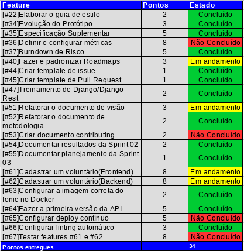
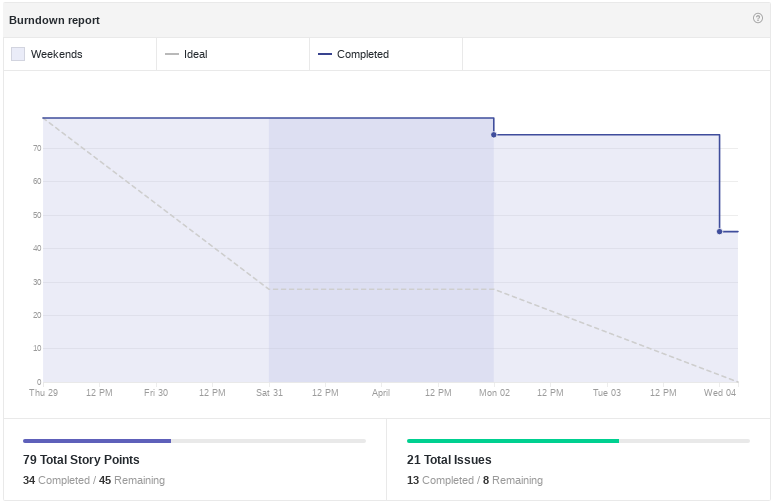
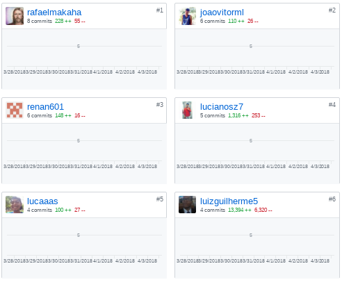
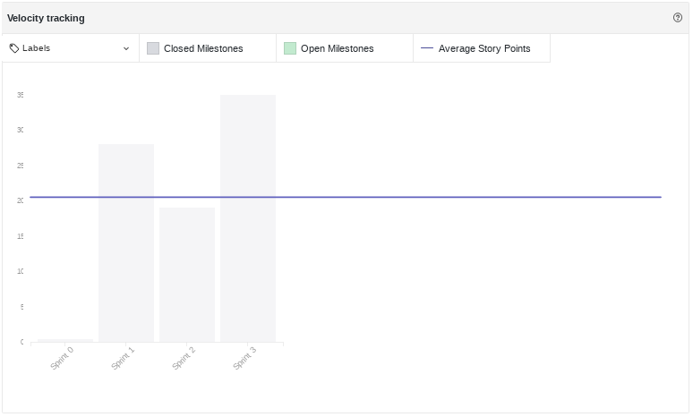
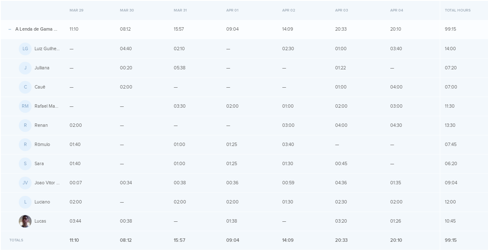
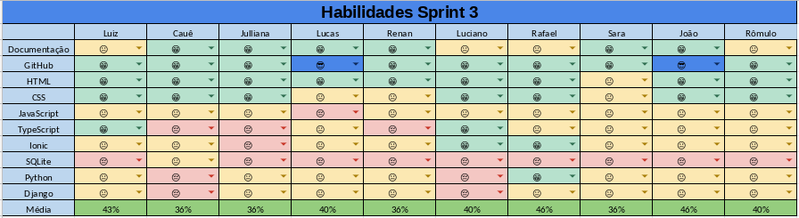
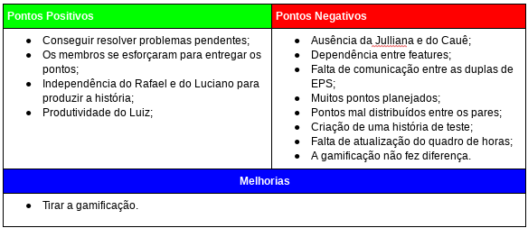

# Resultados da Sprint 03
------

[1. Indicadores de Qualidade do Processo](#1-indicadores-de-qualidade-do-processo)

* [1.1 Fechamento da _Sprint_](#11-fechamento-da-sprint)
* [1.2 _Burndown_](#12-burndown)
* [1.3 Gráfico de _commits_](#13-grafico-de-commits)
* [1.4 _Velocity_](#14-velocity)
* [1.5 Quadro de Horas](#15-quadro-de-horas)
* [1.6 Quadro de Conhecimento](#16-quadro-de-conhecimento)
* [1.7 Melhorias em relação a _Sprint_ 0](#17-melhorias-em-relação-a-sprint-0)
* [1.8 Revisão](#18-revisao-da-sprint)
* [1.9 Retrospectiva](#19-retrospectiva)

[2. Análise do _Scrum Master_](#2-análise-do-scrum-master)  

------

## 1. Indicadores de Qualidade do Processo

### 1.1 Fechamento da _Sprint_

Dos 79 pontos planejados, apenas 34 foram entregues. Isso ocorreu, pois as histórias com mais pontos não foram entregues e, principalmente, porque foi a primeira _Sprint_ em que histórias de usuário foi priorizada para o Time de Desenvolvimento.

### 1.2 _Burndown_

### 1.3 Gráfico de _commits_
Os commits abaixo são referentes ao repositório do _frontend_.

### 1.4 _Velocity_

Apesar da pouca entrega de pontos o velocity subiu de 16 para 20,5 pontos.

### 1.5 Quadro de Horas

### 1.6 Quadro de Conhecimento

Em relação à _Sprint_ anterior é possível houve uma melhoria significativa nos conhecimentos de linguagem. Essas melhorias
ocorreram porque nessa _Sprint_ houve um treinamento de Django/Django Rest e por ter histórias que envolvem programação.

### 1.7 Revisão da _Sprint_

O único problema que houve durante a _Sprint_ foi a falta de conhecimento técnico que impossibilitou a entrega das histórias de usuário.

Durante a reunião foi levantado quais melhorias aplicadas nessa _Sprint_ foram boas. E a conclusão foi que:

* Usar o Kanban ajudou a melhorar a transparência com relação ao _status_ da _issue_, apesar de ainda não estar no ideal e vai continuar sendo aplicada nas próximas _Sprints_;
* Fechar as _issues_ assim que forem concluídas não foi efetivo, pois muitos membros fecharam somente no último dia;
* Utilizar o git para produzir os documentos melhorou o controle de versão,  poupou retrabalho e aumentou a transparência do projeto com relação a quem alterou o documento;
* A mudança de horário das _dailies_ foi significativo, pois se tornou mais eficiente e precisa.

### 1.8 Retrospectiva

### 2. Análise do _Scrum Master_

Essa foi uma _Sprint_ muito positiva em relação às anteriores. Houve uma melhora significativa do Time de Desenvolvimento, que está amadurecendo a cada semana e se tornando mais independente.

O time está se tornando mais produtivo, como pode ser visto pelo aumento gradual do _Velocity_ e também pelo Quadro de Horas em que cada membro está diminuindo a quantidade de horas necessárias para produzir artefatos (ficando em torno de 10 horas, que é o ideal a ser investido em cada _Sprint_).

Também é possível perceber uma melhoria no que diz respeito  ao conhecimento, que também vem crescendo a cada semana. Essa melhora se dá, principalmente, à disponibilidade do membro Luiz, que está sempre ajudando o Time de Desenvolvimento, além do próprio esforço e interesse do Time.

As melhorias aplicadas foram importantes, pois ajudaram a aumentar a transparência do que está sendo produzido e esperado que essas práticas continuem sendo aplicadas continuamente.
