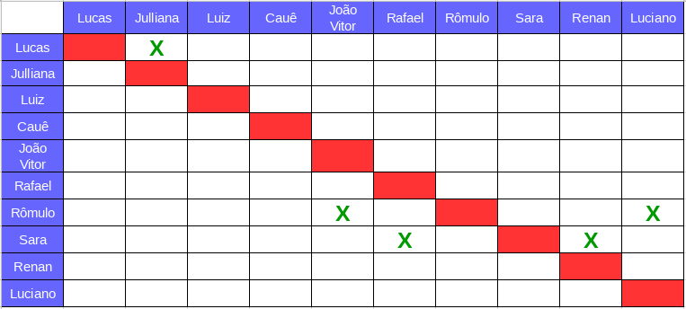
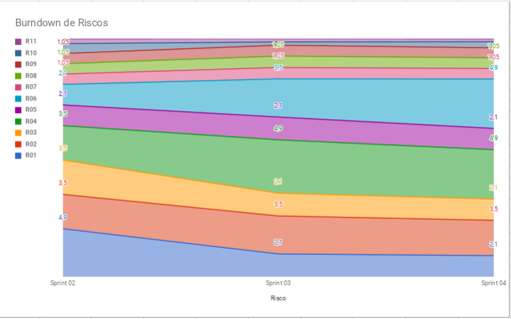

# Planejamento da Sprint 4  

**Número da _Sprint_:** 4

**Data de Início:** 05/04/2018  

**Data de Término:** 11/04/2018

**Duração:** Uma Semana

**Pontos Planejados**: 42

**Pontos Adicionados**: 29

**Pontos Totais**: 71

-------

[1. Pareamento](#1-pareamento)

[2. Mudanças](#2-mudanças)

[3. Priorização](#3-priorizacao)

[4. Burndown de Riscos](#4-burndown-de-riscos)

[5. Histórias da _Sprint_](#5-histórias-da-sprint)

-------
## 1. Pareamento

## 2. Mudanças
A gamificação foi retirada nessa _Sprint_, pois não estava sendo usada adequadamente e estava apenas causando um overhead para controlar a quantidade de experiência e ouro de cada membro ao final da iteração.

## 3. Priorização
A priorização das features foi feita na necessidade de refatorar alguns documentos, sanar algumas dívidas técnicas e também na necessidade de começar a entregar o produto.

## 4. Burndown de Riscos

A  tabela a seguir lista todos os riscos que foram identificados para essa _Sprint_, a probabilidade deles ocorrerem, quantos dias serão perdidos caso o risco ocorra e a exposição ao risco que é calculado multiplicando a probabilidade do risco pelo tamanho da perda.

| # | Descrição | Probabilidade do Risco |Tamanho da Perda (dias)|Exposição ao Risco
| :--- | :------------- | :------------- | :------------- | :------------- |
| 01 | Incompatibilidade de horários para reuniões  | 30%  | 7  | 2,1  |
| 02 | Features má pontuadas  | 50%  | 7 | 3,5  |
| 03 | Baixa produtividade  | 30%  | 7  | 2,1  |
| 04 | Mais pontos planejados do que o time é capaz de entregar  | 70%  | 7  | 4,9  |
| 05 | Dificuldades com a tecnologia de desenvolvimento  | 70%  | 3  | 2,1  |
| 06 | Erros na implementação de Features  | 70%  | 7  |  4,9 |
| 07 | Quebra ou furto de equipamentos da equipe   | 15%   | 7 | 1.05  |
| 08 |  Desistência de algum membro       | 15%    | 7 | 1.05|
| 09 | Problemas na configuração do ambiente de desenvolvimento  | 30%  |  2 | 1  |
| 10 | Dificuldade de se reunir com o cliente   | 30%  | 1  | 0,6  |
| 11 | Dificuldade de se reunir com o cliente   | 30%  | 1  | 0,3  |
|   |   |   | Exposição:  | 23,6  |

Abaixo é mostrado o _Burndown_ de riscos das _Sprints_ em que foi em que ele foi levantado.

## 5. Features da _Sprint_
* <a href="https://github.com/fga-gpp-mds/2018.1-Lacos-da-Alegria/issues/36">[#36]Definir e configurar métricas</a>
* <a href="https://github.com/fga-gpp-mds/2018.1-Lacos-da-Alegria/issues/51">[#51]Refatorar o documento de visão</a>
* <a href="https://github.com/fga-gpp-mds/2018.1-Lacos-da-Alegria/issues/53">[#53]Criar documento contributing</a>
* <a href="https://github.com/fga-gpp-mds/2018.1-Lacos-da-Alegria/issues/38">[#38]EVM</a>
* <a href="https://github.com/fga-gpp-mds/2018.1-Lacos-da-Alegria/issues/53">[#95]Elaborar Roadmap do Scrum Master</a>
* <a href="https://github.com/fga-gpp-mds/2018.1-Lacos-da-Alegria/issues/96">[#96]Elaborar Roadmap de Arquitetura</a>
* <a href="https://github.com/fga-gpp-mds/2018.1-Lacos-da-Alegria/issues/97">[#97]Elaborar Roadmap do DevOps</a>
* <a href="https://github.com/fga-gpp-mds/2018.1-Lacos-da-Alegria/issues/98">[#98]Elaborar Roadmap do Projeto</a>
* <a href="https://github.com/fga-gpp-mds/2018.1-Lacos-da-Alegria/issues/49">[#49]Configurar integração contínua</a>
* <a href="https://github.com/fga-gpp-mds/2018.1-Lacos-da-Alegria/issues/92">[#92]Refatorar Burndown de Riscos de cada Sprint </a>
* <a href="https://github.com/fga-gpp-mds/2018.1-Lacos-da-Alegria/issues/93">[#93]Elaborar EAP</a>
* <a href="https://github.com/fga-gpp-mds/2018.1-Lacos-da-Alegria/issues/94">[#94]Documentar planejamento da Sprint 04 </a>
* <a href="https://github.com/fga-gpp-mds/2018.1-Lacos-da-Alegria/issues/99">[#99]Estudar o benchmarking da aplicação </a>
* <a href="https://github.com/fga-gpp-mds/2018.1-Lacos-da-Alegria/issues/100">[#100]Configurar testes na API </a>
* <a href="https://github.com/fga-gpp-mds/2018.1-Lacos-da-Alegria/issues/101">[#101]Criar e Listar Usuários </a>
* <a href="https://github.com/fga-gpp-mds/2018.1-Lacos-da-Alegria/issues/101">[#101]Criar e Listar Atividades </a>
* <a href="https://github.com/fga-gpp-mds/2018.1-Lacos-da-Alegria/issues/103">[#103]Treinamento de Integração do Frontend ao Backend </a>
