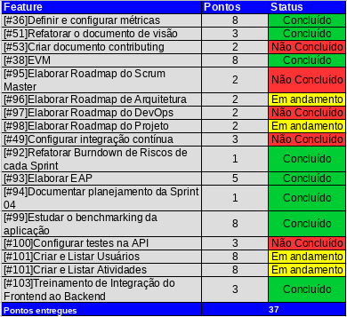
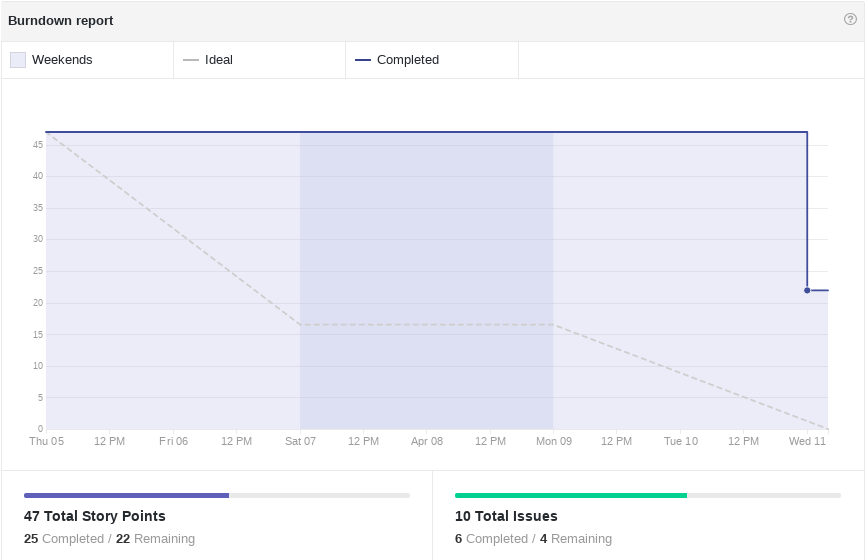
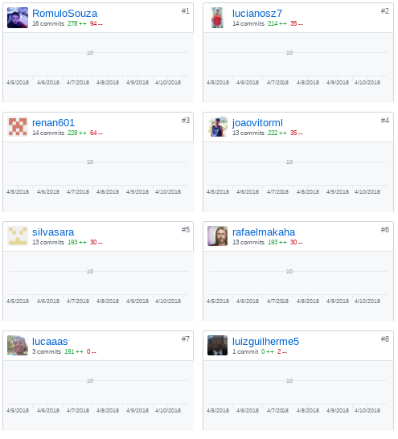
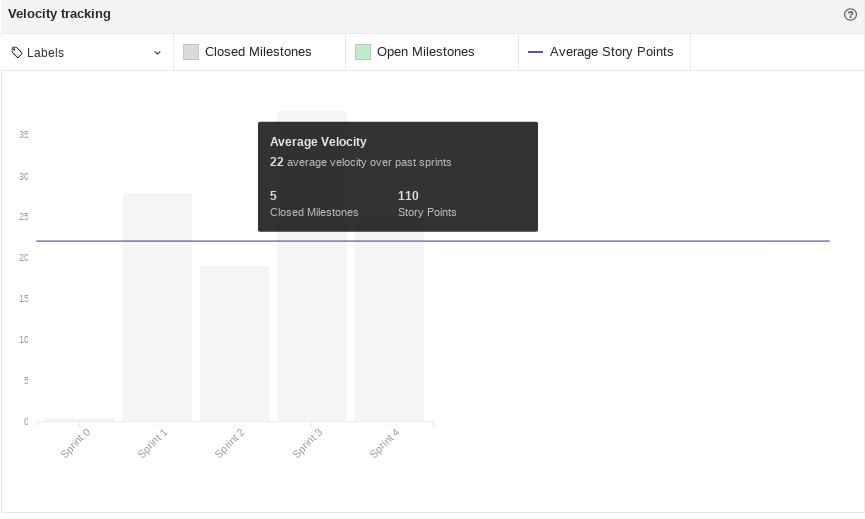
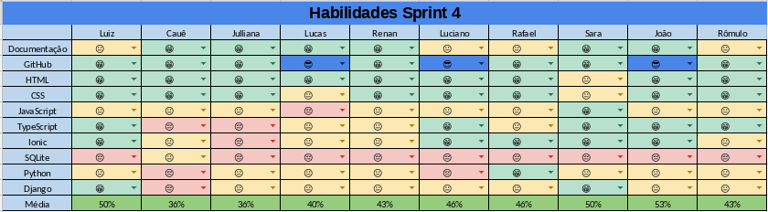
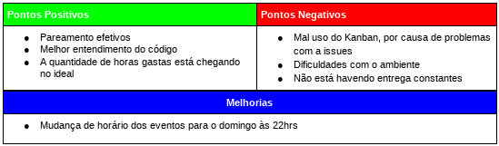

# Sprint 04
------

[1. Indicadores de Qualidade do Processo](#1-indicadores-de-qualidade-do-processo)

* [1.1 Fechamento da _Sprint_](#11-fechamento-da-sprint)
* [1.2 _Burndown_](#12-burndown)
* [1.3 Gráfico de _commits_](#13-grafico-de-commits)
* [1.4 _Velocity_](#14-velocity)
* [1.5 Quadro de Horas](#15-quadro-de-horas)
* [1.6 Quadro de Conhecimento](#16-quadro-de-conhecimento)
* [1.7 Melhorias em relação a _Sprint_ 0](#17-melhorias-em-relação-a-sprint-0)
* [1.8 Revisão](#18-revisao-da-sprint)
* [1.9 Retrospectiva](#19-retrospectiva)

[2. Análise do _Scrum Master_](#2-análise-do-scrum-master)  

------

## 1. Indicadores de Qualidade do Processo

### 1.1 Fechamento da _Sprint_

Dos 71 pontos planejados, 37 foram entregues. Isso ocorreu porque as histórias de usuário ainda não foram testadas e por alguns problemas que aconteceram na _Sprint_ (esses problemas são apresentados [aqui](#18-revisao-da-sprint)).

### 1.2 _Burndown_

No gráfico é possível perceber um longo período em que pontos não foram entregues que aconteceu porque ocorreram muitos problemas durante a _Sprint_.

### 1.3 Gráfico de _commits_
Os _commits_ abaixo são referentes ao repositório do _frontend_.

### 1.4 _Velocity_

Apesar da pouca entrega de pontos o velocity subiu de 20,5 para 22 pontos.

### 1.5 Quadro de Horas

### 1.6 Quadro de Conhecimento

Em relação à _Sprint_ anterior é possível houve uma melhoria nos conhecimentos de documentação, Github, e nas linguagens. Essas melhorias
ocorreram,principalmente, por causa da contínua entrega de documentos e por causa dos treinamentos que ocorreram.

### 1.7 Revisão da _Sprint_

Durante a Revisão da _Sprint_ foram levantados os seguintes problemas que ocorreram na mesma:  
* O computador da Juliana estragou: para contornar esse problema ela usou o de sua irmã, porém o uso era limitado, porque ela usou somente quando sua irmã não estava utilizando-o.
* O Lucas torceu o tornozelo e isso prejudicou o seu desempenho durante a _Sprint_.
* Alguns membros do Time de Desenvolvimento tiveram problemas com o ambiente: isso ocorreu por causa da versão de alguns pacotes, para sanar essa dificuldade os pacotes foram reinstalados.
* _Branch_ subiu com alguns arquivos errados: para resolver esse problema o time subiu outra _branch_ com os arquivos corretos.

Também durante essa reunião foi acordado que a remoção da gamificação foi uma boa melhoria, pois essa não estava trazendo os resultados esperados e mantê-la estava causando um _overhead_.

### 1.8 Retrospectiva

### 2. Análise do _Scrum Master_

O time soube trabalhar bem com os problemas que ocorreram durante a _Sprint_ contornando-os. O Time de Desenvolvimento está conseguindo trabalhar bem com as linguagens, porém com dificuldade com testes e por isso as histórias de usuário não foram entregues. Essa dificuldade será atacada pelo DevOps na próxima _Sprint_ ajudando os desenvolvedores a entender melhor os testes.

Os membros não sentiram impactos com a remoção da gamificação, o que reforça o fato de esta não estar alcançando seu objetivo (motivar os membros). A falta de entrega contínua está sendo um ponto negativo corrente e isso se dá pelo início da _Sprint_ ser no meio da semana e muitas vezes durante o fim de semana não haver muita produção (como pode ser visto no quadro de horas) e por isso foi sugerido a mudança do dia de término e início da _Sprint_.
