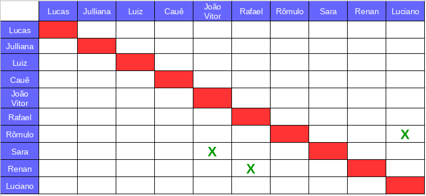
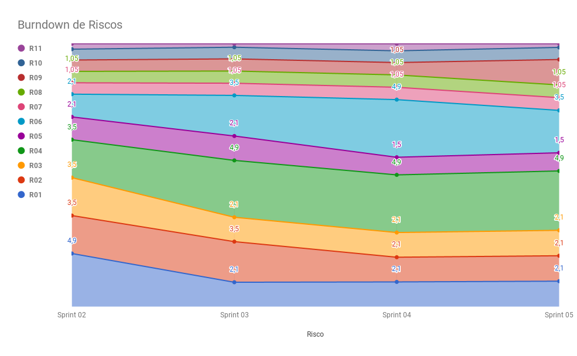

# Planejamento da Sprint 5  

**Número da _Sprint_:** 5

**Data de Início:** 12/04/2018  

**Data de Término:** 22/04/2018

**Duração:** Dez dias

**Pontos Planejados**: 36

**Pontos Adicionados**: 45

**Pontos Totais**: 81

-------

[1. Pareamento](#1-pareamento)

[2. Mudanças](#2-mudanças)

[3. Priorização](#3-priorizacao)

[4. Burndown de Riscos](#4-burndown-de-riscos)

[5. Histórias da _Sprint_](#5-histórias-da-sprint)

-------
## 1. Pareamento

## 2. Mudanças
Essa _Sprint_ está com uma duração que as demais, que tiveram uma semana de duração, pois nas _Sprints_ passadas estava ocorrendo um problema com a entrega constante, em que o time começava a produzir efetivamente às segundas (nos dias anteriores essa produção era muito baixa).
Por isso, as _sprints_ agora começarão e terminarão aos domingos, sendo que a Revisão da Sprint começará às 22hrs e o planejamento da próxima _Sprint_ às 23hrs.

## 3. Priorização
A priorização das _features_ foi feita na necessidade de entregar valor para o cliente, sanar algumas dívidas técnicas e se preparar para a primeira _release_.

## 4. Burndown de Riscos

A  tabela a seguir lista todos os riscos que foram identificados para essa _Sprint_, a probabilidade deles ocorrerem, quantos dias serão perdidos caso o risco ocorra e a exposição ao risco que é calculado multiplicando a probabilidade do risco pelo tamanho da perda.

| # | Descrição | Probabilidade do Risco |Tamanho da Perda (dias)|Exposição ao Risco
| :--- | :------------- | :------------- | :------------- | :------------- |
| 01 | Incompatibilidade de horários para reuniões  | 30%  | 7  | 2,1  |
| 02 | Features má pontuadas  | 30%  | 7 | 2,1  |
| 03 | Baixa produtividade  | 30%  | 7  | 2,1  |
| 04 | Mais pontos planejados do que o time é capaz de entregar  | 70%  | 7  | 4,9  |
| 05 | Dificuldades com a tecnologia de desenvolvimento  | 50%  | 3  | 1,5  |
| 06 | Erros na implementação de Features  | 50%  | 7  |  3,5 |
| 07 | Features mal documentadas   | 15%  | 7  | 1,05  |
| 08 | Quebra ou furto de equipamentos da equipe   | 15%   | 7 | 1,05  |
| 09 | Desistência de algum membro       | 30%    | 7 | 2,1|
| 10 | Problemas na configuração do ambiente de desenvolvimento  | 50%  |  2 | 1  |
| 11 | Dificuldade de se reunir com o cliente   | 30%  | 1  | 0,3  |
|   |   |   | Exposição:  | 21,7 |

Abaixo é mostrado o _Burndown_ de riscos das _Sprints_ em que foi em que ele foi levantado.

## 5. Features da _Sprint_
* <a href="https://github.com/fga-gpp-mds/2018.1-Lacos-da-Alegria/issues/36">[#36]Definir e configurar métricas</a>
* <a href="https://github.com/fga-gpp-mds/2018.1-Lacos-da-Alegria/issues/49">[#49]Configurar integração contínua</a>
* <a href="https://github.com/fga-gpp-mds/2018.1-Lacos-da-Alegria/issues/53">[#53]Criar documento contributing</a>
* <a href="https://github.com/fga-gpp-mds/2018.1-Lacos-da-Alegria/issues/65">[#65]Deploy contínuo</a>
* <a href="https://github.com/fga-gpp-mds/2018.1-Lacos-da-Alegria/issues/95">[#95]Elaborar Roadmap do Scrum Master</a>
* <a href="https://github.com/fga-gpp-mds/2018.1-Lacos-da-Alegria/issues/96">[#96]Elaborar Roadmap de Arquitetura</a>
* <a href="https://github.com/fga-gpp-mds/2018.1-Lacos-da-Alegria/issues/97">[#97]Elaborar Roadmap do DevOps</a>
* <a href="https://github.com/fga-gpp-mds/2018.1-Lacos-da-Alegria/issues/98">[#98]Elaborar Roadmap do Projeto</a>
* <a href="https://github.com/fga-gpp-mds/2018.1-Lacos-da-Alegria/issues/100">[#100]Configurar testes na API</a>
* <a href="https://github.com/fga-gpp-mds/2018.1-Lacos-da-Alegria/issues/101">[#101]Criar e Listar Usuários</a>
* <a href="https://github.com/fga-gpp-mds/2018.1-Lacos-da-Alegria/issues/102">[#102]Criar e Listar Atividades</a>
* <a href="https://github.com/fga-gpp-mds/2018.1-Lacos-da-Alegria/issues/107">[#107]Documentar resultados da Sprint 04</a>
* <a href="https://github.com/fga-gpp-mds/2018.1-Lacos-da-Alegria/issues/108">[#108]Documentar planejamento da Sprint 05</a>
* <a href="https://github.com/fga-gpp-mds/2018.1-Lacos-da-Alegria/issues/109">[#109]Refatorar docs das Sprints</a>
* <a href="https://github.com/fga-gpp-mds/2018.1-Lacos-da-Alegria/issues/110">[#110]Configurar github pages</a>
* <a href="https://github.com/fga-gpp-mds/2018.1-Lacos-da-Alegria/issues/111">[#111]Ambiente de homologação</a>
* <a href="https://github.com/fga-gpp-mds/2018.1-Lacos-da-Alegria/issues/112">[#112]Refatorar documento de arquitetura</a>
* <a href="https://github.com/fga-gpp-mds/2018.1-Lacos-da-Alegria/issues/113">[#113]Política de Branches</a>
* <a href="https://github.com/fga-gpp-mds/2018.1-Lacos-da-Alegria/issues/114">[#114]Implementar login de usuário</a>
* <a href="https://github.com/fga-gpp-mds/2018.1-Lacos-da-Alegria/issues/115">[#115]Implementar logout de usuário</a>
* <a href="https://github.com/fga-gpp-mds/2018.1-Lacos-da-Alegria/issues/116">[#116]Implementar fila de espera para usuários novatos</a>
* <a href="https://github.com/fga-gpp-mds/2018.1-Lacos-da-Alegria/issues/117">[#117]Implementar detalhamento de uma atividade</a>
* <a href="https://github.com/fga-gpp-mds/2018.1-Lacos-da-Alegria/issues/118">[#118]Criar o frontend do aplicativo</a>
