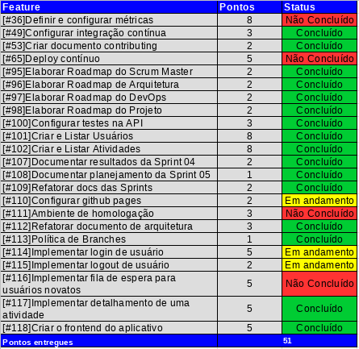
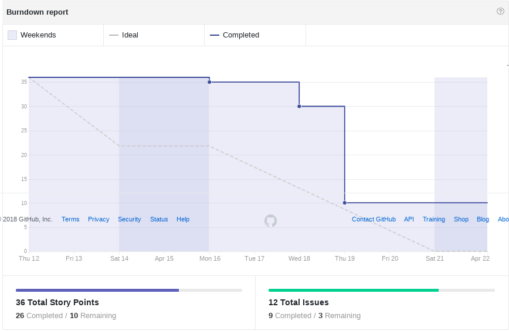
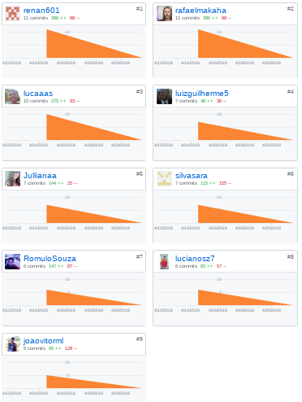
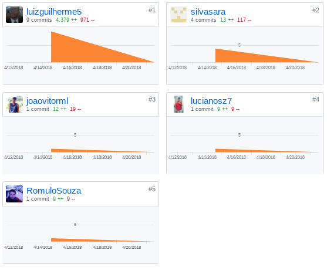
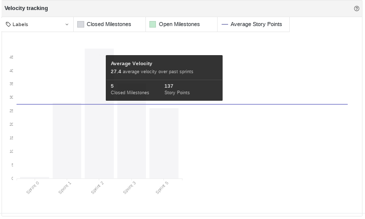
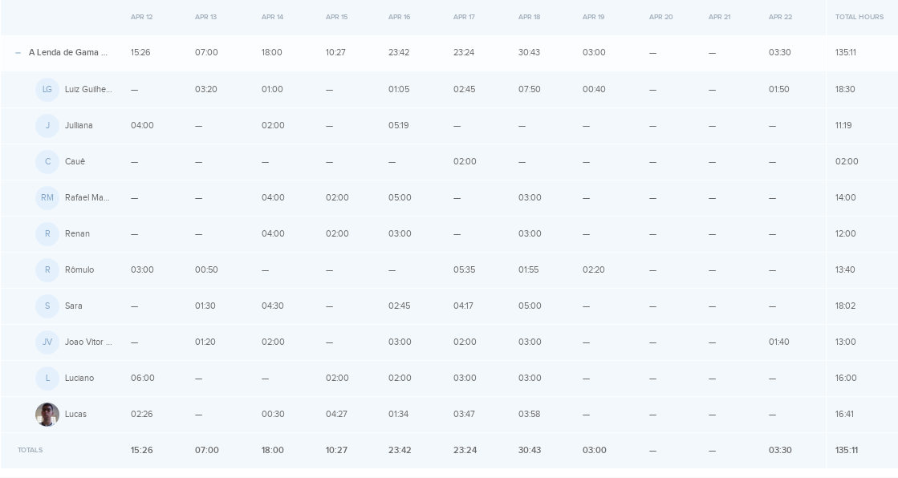
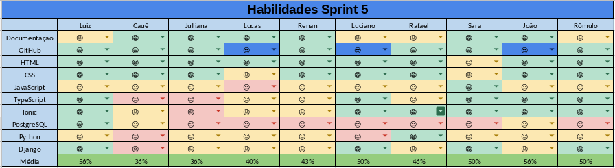
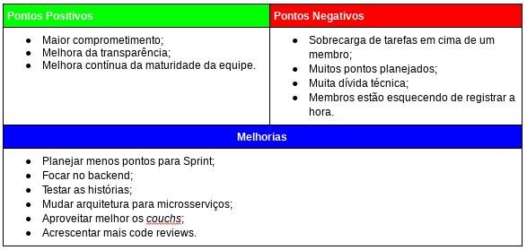

# Resultados da Sprint 05
------

[1. Indicadores de Qualidade do Processo](#1-indicadores-de-qualidade-do-processo)

* [1.1 Fechamento da _Sprint_](#11-fechamento-da-sprint)
* [1.2 _Burndown_](#12-burndown)
* [1.3 Gráfico de _commits_](#13-grafico-de-commits)
* [1.4 _Velocity_](#14-velocity)
* [1.5 Quadro de Horas](#15-quadro-de-horas)
* [1.6 Quadro de Conhecimento](#16-quadro-de-conhecimento)
* [1.7 Revisão](#17-revisao-da-sprint)
* [1.8 Retrospectiva](#18-retrospectiva)

[2. Análise do _Scrum Master_](#2-análise-do-scrum-master)  

------

## 1. Indicadores de Qualidade do Processo

### 1.1 Fechamento da _Sprint_

Dos 81 pontos planejados, 51 foram entregues. Isso ocorreu porque muitos pontos foram planejados para essa _Sprint_.

### 1.2 _Burndown_

Nessa _Sprint_ é possível perceber uma melhora significativa no gráfico, em relação as _Sprints_ anteriores. Apesar de ainda não estar no ideal, isso mostra que o time está amadurecendo e fechando as _issues_ mais cedo.

### 1.3 Gráfico de _commits_

Os _commits_ abaixo são referentes ao repositório do _frontend_.

Abaixo são mostrados os _commits_ referentes ao repositório da API.

### 1.4 _Velocity_

Nessa _Sprint_ o _velocity_ subiu de 22 para 27,4 pontos.

### 1.5 Quadro de Horas

### 1.6 Quadro de Conhecimento

No geral, não houve uma melhora significativa dos conhecimentos. Mas alguns membros melhoraram nas linguagens.

### 1.7 Revisão da _Sprint_

Nessa _sprint_ não ocorreram problemas e só será possível avaliar os impactos das mudanças ao final da _sprint_ 06.

### 1.8 Retrospectiva

### 2. Análise do _Scrum Master_

Nessa _Sprint_ houve uma melhora da transparência do projeto, pois os membros começaram a usar melhor o Kanban. E a melhora que está ocorrendo nas últimas _Sprints_ também ocorreu nessa.

Nessa iteração foi possível perceber um maior engajamento da equipe em entregar os pontos planejados e isso é refletido no Kanban.

Quanto à produtividade, o _velocity_ aumentou mais que nas outras _Sprints_, porém a maioria dos membros gastou bem mais de 10 horas. Esse gasto maior de horas ocorreu, porque a duração dessa _Sprint_ foi maior e por isso não é possível dizer se a produtividade da equipe aumentou ou diminuiu.
