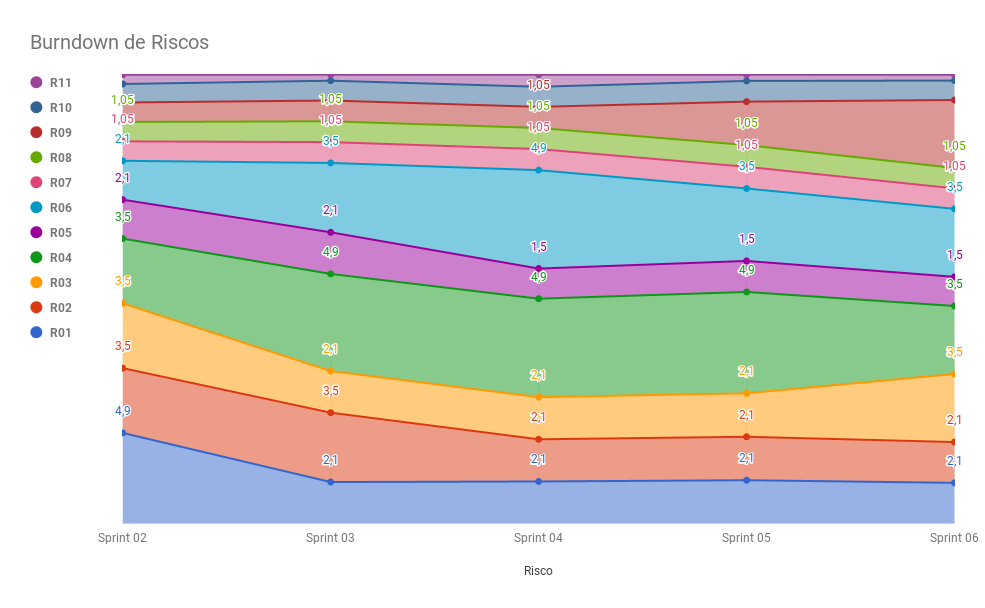

# Planejamento da Sprint 6

**Data de Início:** 23/04/2018  

**Data de Término:** 29/04/2018

**Duração:** Uma semana

**Pontos Planejados**: 18

**Pontos Adicionados**: 16

**Pontos Totais**: 34

-------

[1. Pareamento](#1-pareamento)

[2. Mudanças](#2-mudanças)

[3. Priorização](#3-priorizacao)

[4. Burndown de Riscos](#4-burndown-de-riscos)

[5. Features da _Sprint_](#5-features-da-sprint)

-------
## 1. Pareamento

## 2. Mudanças

A partir dessa _Sprint_ os membros Julliana e Lucas serão, também, _code reviewers_.

## 3. Priorização
A priorização das _features_ foi feita na necessidade de entregar valor para o cliente e sanar algumas dívidas técnicas.

## 4. Burndown de Riscos

A  tabela a seguir lista todos os riscos que foram identificados para essa _Sprint_, a probabilidade deles ocorrerem, quantos dias serão perdidos caso o risco ocorra e a exposição ao risco que é calculado multiplicando a probabilidade do risco pelo tamanho da perda.

| # | Descrição | Probabilidade do Risco |Tamanho da Perda (dias)|Exposição ao Risco
| :--- | :------------- | :------------- | :------------- | :------------- |
| 01 | Incompatibilidade de horários para reuniões  | 30%  | 7  | 2,1  |
| 02 | Features má pontuadas  | 30%  | 7 | 2,1  |
| 03 | Baixa produtividade  | 50%  | 7  | 3,5  |
| 04 | Mais pontos planejados do que o time é capaz de entregar  | 50%  | 7  | 3,5  |
| 05 | Dificuldades com a tecnologia de desenvolvimento  | 50%  | 3  | 1,5  |
| 06 | Erros na implementação de Features  | 50%  | 7  |  3,5 |
| 07 | Features mal documentadas   | 15%  | 7  | 1,05  |
| 08 | Quebra ou furto de equipamentos da equipe   | 15%   | 7 | 1,05  |
| 09 | Desistência de algum membro       | 50%    | 7 | 3,5|
| 10 | Problemas na configuração do ambiente de desenvolvimento  | 50%  |  2 | 1  |
| 11 | Dificuldade de se reunir com o cliente   | 30%  | 1  | 0,3  |
|   |   |   | Exposição:  | 23,1 |

Abaixo é mostrado o _Burndown_ de riscos das _Sprints_ em que foi em que ele foi levantado.

## 5. Features da _Sprint_
* <a href="https://github.com/fga-gpp-mds/2018.1-Lacos-da-Alegria/issues/36">[#36]Definir e configurar métricas</a>
* <a href="https://github.com/fga-gpp-mds/2018.1-Lacos-da-Alegria/issues/65">[#65]Deploy contínuo</a>
* <a href="https://github.com/fga-gpp-mds/2018.1-Lacos-da-Alegria/issues/111">[#111]Ambiente de homologação</a>
* <a href="https://github.com/fga-gpp-mds/2018.1-Lacos-da-Alegria/issues/139">[#139] Documentar resultados da Sprint 05</a>
* <a href="https://github.com/fga-gpp-mds/2018.1-Lacos-da-Alegria/issues/140">[#140] Documentar planejamento da Sprint 06</a>
* <a href="https://github.com/fga-gpp-mds/2018.1-Lacos-da-Alegria/issues/141">[#141] Testar funcionalidades de usuário</a>
* <a href="https://github.com/fga-gpp-mds/2018.1-Lacos-da-Alegria/issues/142">[#142] Testar funcionalidades de atividade</a>
* <a href="https://github.com/fga-gpp-mds/2018.1-Lacos-da-Alegria/issues/143">[#143] Voluntário se inscrever em uma atividade</a>
