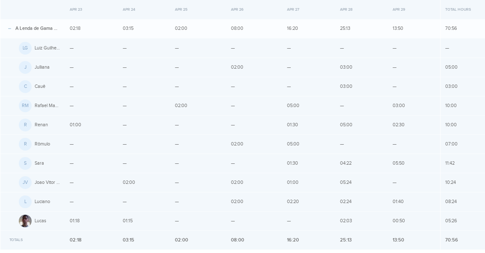
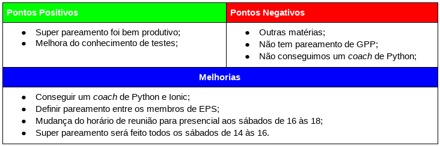

# Resultados da Sprint 06
------

[1. Indicadores de Qualidade do Processo](#1-indicadores-de-qualidade-do-processo)

* [1.1 Fechamento da _Sprint_](#11-fechamento-da-sprint)
* [1.2 _Burndown_](#12-burndown)
* [1.3 Gráfico de _commits_](#13-grafico-de-commits)
* [1.4 _Velocity_](#14-velocity)
* [1.5 Quadro de Horas](#15-quadro-de-horas)
* [1.6 Quadro de Conhecimento](#16-quadro-de-conhecimento)
* [1.7 Melhorias em relação a _Sprint_ 0](#17-melhorias-em-relação-a-sprint-0)
* [1.8 Revisão](#18-revisao-da-sprint)
* [1.9 Retrospectiva](#19-retrospectiva)

[2. Análise do _Scrum Master_](#2-análise-do-scrum-master)  

------

## 1. Indicadores de Qualidade do Processo

### 1.1 Fechamento da _Sprint_

Dos 34 pontos planejados, 13 foram entregues. Isso ocorreu porque a história de usuário ainda não foi testada e pela dificuldade em automatizar o _pipeline_ de DevOps.

### 1.2 _Burndown_

No gráfico é possível perceber um longo período em que pontos não foram entregues, porque houve um atraso em analisar os _pull requests_ feitos.

### 1.3 Gráfico de _commits_
Os _commits_ abaixo são referentes ao repositório do _frontend_.

### 1.4 _Velocity_

Em relação a _Sprint_ passada, o velocity caiu de 27,4 para 27,17.

### 1.5 Quadro de Horas

### 1.6 Quadro de Conhecimento

Como essa _Sprint_ foi focada no _backend_ a maioria do Time de Desenvolvimento melhorou nesse aspecto.

### 1.7 Revisão da _Sprint_

O maior problema da _Sprint_ foi a falta de conhecimento em testes unitários e para resolvê-lo o Time de Desenvolvimento  parou um pouco o desenvolvimento e focou em estudar testes.

Quanto às melhorias foi levantado o seguinte:

* Planejar menos pontos para Sprint: foi bom, apesar de não estar no ideal. Mas está melhorando.
* Focar no _backend_: não foi bom, pois adia riscos que podem acontecer no _frontend_.
* Testar as histórias: foi bom, pois melhora a qualidade do produto.
* Mudar arquitetura para microsserviços: não foi bom, pois gera muito retrabalho e por isso não será feito.
* Aproveitar melhor os coaches: não ocorreu nessa _Sprint_, mas o time tentará aplicar na próxima.
* Acrescentar mais code reviews: não houve uma melhora, pois a análise dos _pull requests_ atrasou. Na próxima _sprint_ o time tentará aproveitar melhor essa mudança.

### 1.8 Retrospectiva

### 2. Análise do _Scrum Master_

Essa foi a _Sprint_ menos produtiva da equipe e isso é percebido pela queda do velocity, ainda que pequena, e pela quantidade de horas gastas que foi muito abaixo do esperado.

Apesar disso, o Time de Desenvolvimento continua cada vez mais maduro e independente. Durante a iteração eles mesmos perceberam o problema da falta de conhecimento e buscaram aprender o assunto. Tanto é que as histórias de testes foram entregues.
