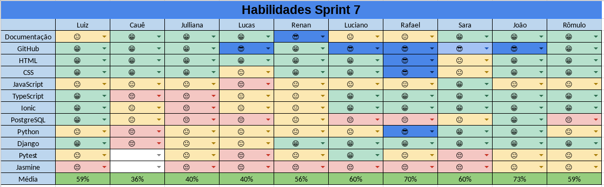

# Resultados da Sprint 07
------

[1. Indicadores de Qualidade do Processo](#1-indicadores-de-qualidade-do-processo)

* [1.1 Fechamento da _Sprint_](#11-fechamento-da-sprint)
* [1.2 _Burndown_](#12-burndown)
* [1.3 Gráfico de _commits_](#13-grafico-de-commits)
* [1.4 _Velocity_](#14-velocity)
* [1.5 Quadro de Horas](#15-quadro-de-horas)
* [1.6 Quadro de Conhecimento](#16-quadro-de-conhecimento)
* [1.7 Melhorias em relação a _Sprint_ 0](#17-melhorias-em-relação-a-sprint-0)
* [1.8 Revisão](#18-revisao-da-sprint)
* [1.9 Retrospectiva](#19-retrospectiva)

[2. Análise do _Scrum Master_](#2-análise-do-scrum-master)  

------

## 1. Indicadores de Qualidade do Processo

### 1.1 Fechamento da _Sprint_

Dos 64 pontos planejados, 13 foram entregues.

### 1.2 _Burndown_

No gráfico é possível perceber um longo período em que pontos não foram entregues, porque houve um atraso em analisar os _pull requests_ feitos.

### 1.4 _Velocity_

Em relação a _Sprint_ passada, o velocity caiu de 27,4 para 22,14.

### 1.5 Quadro de Horas

### 1.6 Quadro de Conhecimento

O Time de Desenvolvimento continua dominando cada vez mais os conhecimentos necessários e nessa _Sprint_ houve uma melhora especial de alguns membros nos testes.

### 1.7 Custos

### 1.8 Revisão da _Sprint_

Não houve problemas durante a _Sprint_ e ainda não é possível avaliar as mudanças aplicadas.

### 1.9 Retrospectiva

### 2. Análise do _Scrum Master_

Em relação a _Sprint_ anterior, essa melhorou muito pouco. Poucos pontos foram entregues e o _Velocity_ caiu muito. Isso ocorreu porque os membros de MDS tinham outras matérias para focar e esse risco não foi identificado a tempo.

Também houve pouca cobrança por parte do _Scrum Master_ e houve um problema com as Dailies, em que muitos membros não participaram.

Em oposição a tudo isso, é possível observar uma independência e uma maturidade maior do Time de Desenvolvimento e uma melhora com relação a testes. Futuramente, serão focados os testes de aceitação, finalizando todo o processo de implementação (implementação, validação, testes unitários e testes de aceitação).

