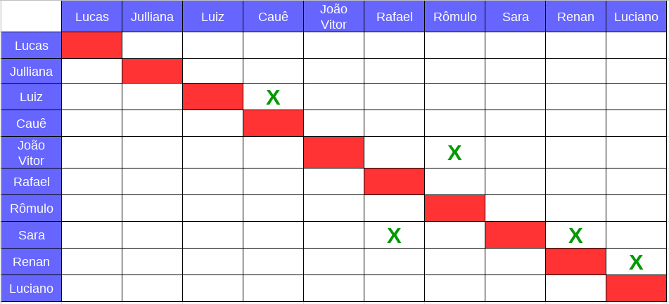
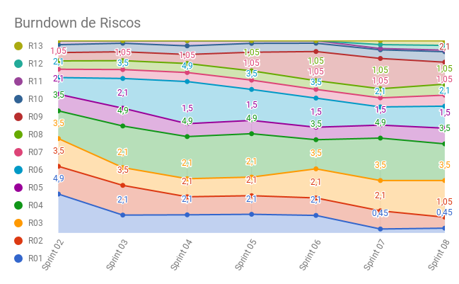

# Planejamento da Sprint 8

**Data de Início:** 06/05/2018  

**Data de Término:** 12/05/2018

**Duração:** Uma semana

**Pontos Planejados**: 19

**Pontos Adicionados**: 38

**Pontos Totais**: 57

-------

[1. Pareamento](#1-pareamento)

[2. Mudanças](#2-mudanças)

[3. Priorização](#3-priorizacao)

[4. Burndown de Riscos](#4-burndown-de-riscos)

[5. Features da _Sprint_](#5-features-da-sprint)

-------
## 1. Pareamento

## 2. Mudanças

Nessa _Sprint_ foram adicionados mais um superpareamento às segundas das 12hrs até às 14 e dailies presenciais às segundas e quinta-feiras de 12hrs até 12:15h e às terças de 13:45h às 14hrs.

## 3. Priorização

A priorização das _features_ foi feita para sanar as dívidas técnicas e para entregar valor para o cliente.

## 4. Burndown de Riscos

A  tabela a seguir lista todos os riscos que foram identificados para essa _Sprint_, a probabilidade deles ocorrerem, quantos dias serão perdidos caso o risco ocorra e a exposição ao risco que é calculado multiplicando a probabilidade do risco pelo tamanho da perda. Essa _Sprint_ foram identificados dois novos riscos.

| # | Descrição | Probabilidade do Risco |Tamanho da Perda (dias)|Exposição ao Risco
| :--- | :------------- | :------------- | :------------- | :------------- |
| 01 | Incompatibilidade de horários para reuniões  | 15%  | 3  | 0,45  |
| 02 | Features má pontuadas  | 30%  | 7 | 2,1  |
| 03 | Baixa produtividade  | 50%  | 7  | 3,5  |
| 04 | Mais pontos planejados do que o time é capaz de entregar  | 50%  | 7  | 4,9  |
| 05 | Dificuldades com a tecnologia de desenvolvimento  | 50%  | 3  | 1,5  |
| 06 | Erros na implementação de Features  | 30%  | 7  |  2,1 |
| 07 | Features mal documentadas   | 15%  | 7  | 1,05  |
| 08 | Quebra ou furto de equipamentos da equipe   | 15%   | 7 | 1,05  |
| 09 | Desistência de algum membro       | 30% | 7 | 2,1|
| 10 | Problemas na configuração do ambiente de desenvolvimento  | 50%  |  2 | 1  |
| 11 | Dificuldade de se reunir com o cliente   | 15%  | 1  | 0,15  |
| 12 | Indisponibilidaade dos membros de MDS  | 15% | 3 | 0,45 |
| 13 | Indisponibilidaade dos membros de EPS  | 15% | 3 | 0,45 |
|   |   |   | Exposição:  | 21,7 |

Abaixo é mostrado o _Burndown_ de riscos das _Sprints_ em que foi em que ele foi levantado.

## 5. Features da _Sprint_
* <a href="https://github.com/fga-gpp-mds/2018.1-Lacos-da-Alegria/issues/36">[#36]Definir e configurar métricas </a>
* <a href="https://github.com/fga-gpp-mds/2018.1-Lacos-da-Alegria/issues/64">[#65] Deploy contínuo </a>
* <a href="https://github.com/fga-gpp-mds/2018.1-Lacos-da-Alegria/issues/111">[#111] Ambiente de homologação </a>
* <a href="https://github.com/fga-gpp-mds/2018.1-Lacos-da-Alegria/issues/114">[#114] Login </a>
* <a href="https://github.com/fga-gpp-mds/2018.1-Lacos-da-Alegria/issues/115">[#115] Logout </a>
* <a href="https://github.com/fga-gpp-mds/2018.1-Lacos-da-Alegria/issues/143">[#143] Voluntário se inscrever em uma atividade </a>
* <a href="https://github.com/fga-gpp-mds/2018.1-Lacos-da-Alegria/issues/146">[#146] US09 - Visualizar Splash Screen / Tutorial </a>
* <a href="https://github.com/fga-gpp-mds/2018.1-Lacos-da-Alegria/issues/163">[#163] Testar as funcionalidades de atividade  no frontend </a>
* <a href="https://github.com/fga-gpp-mds/2018.1-Lacos-da-Alegria/issues/164">[#164] Perfil de usuário </a>
* <a href="https://github.com/fga-gpp-mds/2018.1-Lacos-da-Alegria/issues/165">[#165] Refatorar protótipo </a>
* <a href="https://github.com/fga-gpp-mds/2018.1-Lacos-da-Alegria/issues/175">[#175] Documentar resultados da Sprint 07 </a>
* <a href="https://github.com/fga-gpp-mds/2018.1-Lacos-da-Alegria/issues/178">[#178] Documentar planejamento da Sprint 08 </a>
* <a href="https://github.com/fga-gpp-mds/2018.1-Lacos-da-Alegria/issues/169">[#169] Refatorar EVM </a>
* <a href="https://github.com/fga-gpp-mds/2018.1-Lacos-da-Alegria/issues/179">[#179] Elaborar Canvas </a>
* <a href="https://github.com/fga-gpp-mds/2018.1-Lacos-da-Alegria/issues/180">[#180] Elaborar 5W2H </a>
* <a href="https://github.com/fga-gpp-mds/2018.1-Lacos-da-Alegria/issues/181">[#181] Refatorar frontend </a>
