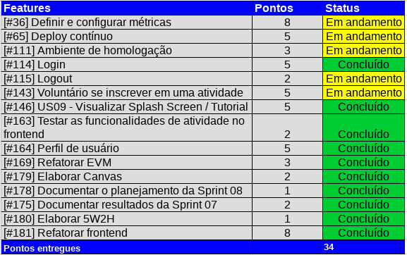
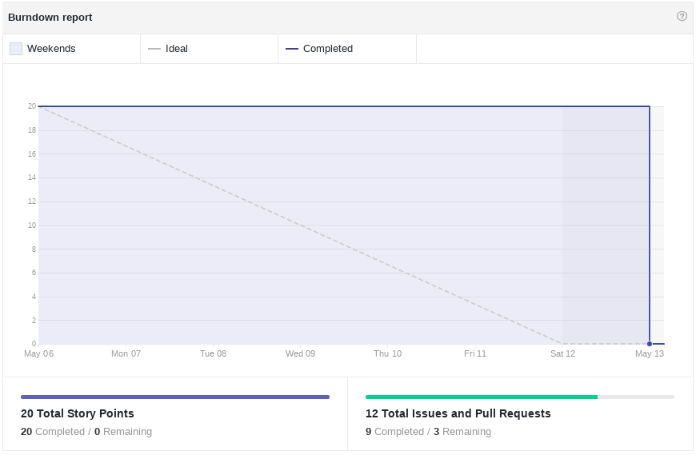
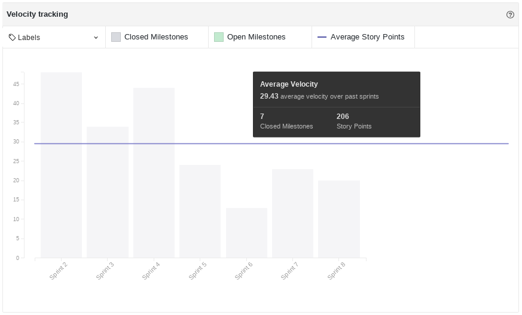
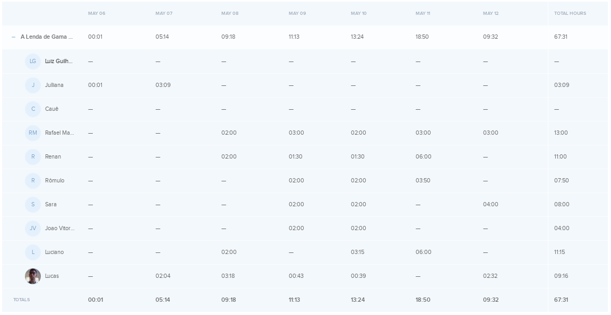
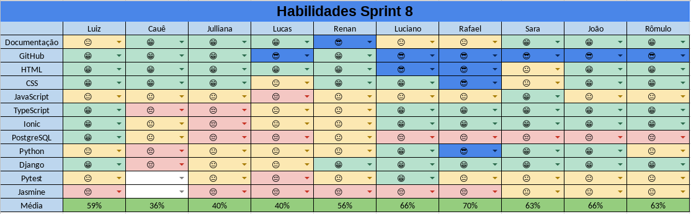
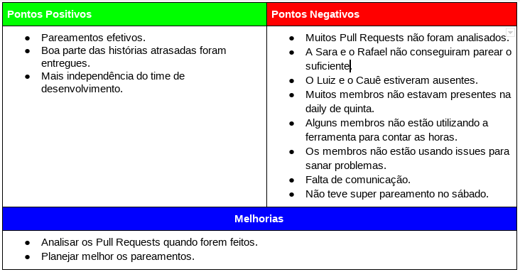

# Resultados da Sprint 08

[1. Indicadores de Qualidade do Processo](#1-indicadores-de-qualidade-do-processo)

* [1.1 Fechamento da _Sprint_](#11-fechamento-da-sprint)
* [1.2 _Burndown_](#12-burndown)
* [1.3 Gráfico de _commits_](#13-grafico-de-commits)
* [1.4 _Velocity_](#14-velocity)
* [1.5 Quadro de Horas](#15-quadro-de-horas)
* [1.6 Quadro de Conhecimento](#16-quadro-de-conhecimento)
* [1.7 Melhorias em relação a _Sprint_ 0](#17-melhorias-em-relação-a-sprint-0)
* [1.8 Revisão](#18-revisao-da-sprint)
* [1.9 Retrospectiva](#19-retrospectiva)

[2. Análise do _Scrum Master_](#2-análise-do-scrum-master)  

------

## 1. Indicadores de Qualidade do Processo

### 1.1 Fechamento da _Sprint_

Dos 57 pontos planejados, 34 foram entregues.

### 1.2 _Burndown_

No gráfico é possível perceber um longo período em que pontos não foram entregues, porque houve um atraso em analisar os _pull requests_ feitos.

### 1.4 _Velocity_

Em relação a _Sprint_ passada, o velocity subiu de 22,14 para 29,43.

### 1.5 Quadro de Horas

### 1.6 Quadro de Conhecimento

O Time de Desenvolvimento continua adquirindo os conhecimentos relevantes para o projeto. E nessa _Sprint_ os membros melhoraram no _backend_ e no _git_.

### 1.7 EVM 

#### Valor Planejado x Custo Real x Valor Agregado 

#### Variação de Custos x Variação de Prazos 

#### Índices de Desempenho 

### 1.8 Análise do Tracker
Na oitava Sprint foram planejados 22 pontos, além dos 35 pontos adicionados, no entanto foram feitos apenas  34 pontos. Na visão do cliente, o projeto deveria estar com 60,00% do projeto inteiro, como não foram entregues todos os pontos, foram entregues apenas 56,24%. Para ver EVM completa acesse o link: [evm](https://docs.google.com/spreadsheets/d/1UhuJbHicONbdPg4TTNmiDS6sEkknskACSvgKSooy36A/edit#gid=0)

### 1.9 Revisão da _Sprint_

Durante a _Sprint_ ocorreram os seguintes problemas:

* O membro Lucas teve dificuldades com o ambiente, como pode ser visto nas _issues_ <a href="https://github.com/fga-gpp-mds/2018.1-Lacos-da-Alegria/issues/184">#184</a> e <a href="https://github.com/fga-gpp-mds/2018.1-Lacos-da-Alegria/issues/185">#185</a>, mas foi resolvido com a ajuda dos membros Luciano e Rômulo.
* O Renan teve alguns problemas na máquina que ainda não foram resolvidos. Porém este problema não afetou seu desempenho durante a _Sprint_.
* O _coach_ não pode participar da "seção tira dúvidas" que havia marcado por motivos pessoais.

### 2. Retrospectiva

### 2.1 Análise do _Scrum Master_

Com relação às duas últimas _Sprints_ essa foi muito boa, pois foram entregues quase todas as dívidas técnicas relacionadas ao código. Porém, as dívidas relacionadas ao processo ainda estão pendentes e isso é um problema para o time que pode se prejudicar em futuro próximo.

A análise dos PRs foi um problema grave nessa _Sprint_, pois prejudica a entrega contínua. Mas serão tomadas medidas para isso não se repetir nas próximas iterações.

É bom ver que o _Velocity_ está subindo novamente com uma média de dez horas por membros (os que marcaram as horas). E, por fim, é necessário tomar medidas para melhorar a transparência e a comunicação do time.

