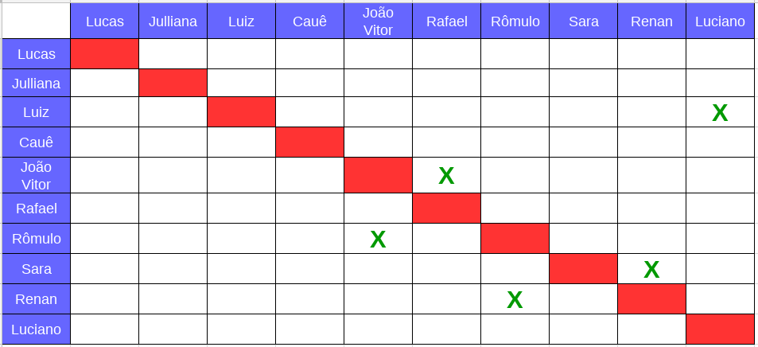
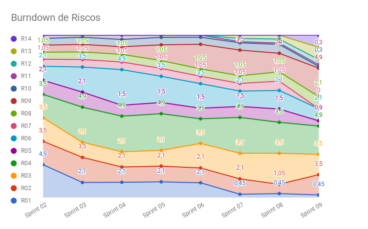

# Planejamento da Sprint 9

**Data de Início:** 14/05/2018  

**Data de Término:** 19/05/2018

**Duração:** Seis dias

**Pontos Planejados**: 40

**Pontos Adicionados**: 36

**Pontos Totais**: 76

-------

[1. Pareamento](#1-pareamento)

[2. Mudanças](#2-mudanças)

[3. Priorização](#3-priorizacao)

[4. Burndown de Riscos](#4-burndown-de-riscos)

[5. Features da _Sprint_](#5-features-da-sprint)

-------
## 1. Pareamento

## 2. Mudanças
Essa _Sprint_ está com uma duração menor, pois as reuniões de fim e início da próxima _Sprint_ ocorrerá no sábado como decidido nas _Sprints_ anteriores.

## 3. Priorização
A priorização das _features_ foi feita na necessidade de entregar valor para o cliente, sanar algumas dívidas técnicas e garantir a qualidade do produto.

## 4. Burndown de Riscos

A  tabela a seguir lista todos os riscos que foram identificados para essa _Sprint_, a probabilidade deles ocorrerem, quantos dias serão perdidos caso o risco ocorra e a exposição ao risco que é calculado multiplicando a probabilidade do risco pelo tamanho da perda.

Durante o planejamento foi identificado mais um risco.

| # | Descrição | Probabilidade do Risco |Tamanho da Perda (dias)|Exposição ao Risco
| :--- | :------------- | :------------- | :------------- | :------------- |
| 01 | Incompatibilidade de horários para reuniões  | 15%  | 3  | 0,45  |
| 02 | Features má pontuadas  | 50%  | 7 | 3,5  |
| 03 | Baixa produtividade  | 50%  | 7  | 3,5  |
| 04 | Mais pontos planejados do que o time é capaz de entregar  | 70%  | 7  | 4,9  |
| 05 | Dificuldades com a tecnologia de desenvolvimento  | 30%  | 3  | 0,9 |
| 06 | Erros na implementação de Features  | 30%  | 7  |  2,1 |
| 07 | Features mal documentadas   | 0%  | 7  | 0  |
| 08 | Quebra ou furto de equipamentos da equipe   | 30%  | 7 | 2,1  |
| 09 | Desistência de algum membro       | 70% | 7 | 4,9|
| 10 | Problemas na configuração do ambiente de desenvolvimento  | 15%  |  2 | 0,3 |
| 11 | Dificuldade de se reunir com o cliente   | 30%  | 1  | 0,3  |
| 12 | Indisponibilidade dos membros de MDS  | 30% | 3 | 0,9 |
| 13 | Indisponibilidade dos membros de EPS  | 70% | 3 | 2,1 |
| 14 | Falta de comunicação | 70% | 3 | 2,1 |
|   |   |   | Exposição:  | 28,05 |

Abaixo é mostrado o _Burndown_ de riscos das _Sprints_ em que foi em que ele foi levantado.

## 5. Features da _Sprint_
* <a href="https://github.com/fga-gpp-mds/2018.1-Lacos-da-Alegria/issues/36">[#36]Definir e configurar métricas </a>
* <a href="https://github.com/fga-gpp-mds/2018.1-Lacos-da-Alegria/issues/64">[#65] Deploy contínuo </a>
* <a href="https://github.com/fga-gpp-mds/2018.1-Lacos-da-Alegria/issues/111">[#111] Ambiente de homologação </a>
* <a href="https://github.com/fga-gpp-mds/2018.1-Lacos-da-Alegria/issues/115">[#115] Logout </a>
* <a href="https://github.com/fga-gpp-mds/2018.1-Lacos-da-Alegria/issues/143">[#143] Voluntário se inscrever em uma atividade </a>
* <a href="https://github.com/fga-gpp-mds/2018.1-Lacos-da-Alegria/issues/193">[#193]Refatorar as funcionalidades de usuário no frontend </a>
* <a href="https://github.com/fga-gpp-mds/2018.1-Lacos-da-Alegria/issues/148">[#148] Visualizar ONGs </a>
* <a href="https://github.com/fga-gpp-mds/2018.1-Lacos-da-Alegria/issues/197">[#197] Configurar os testes de aceitação </a>
* <a href="https://github.com/fga-gpp-mds/2018.1-Lacos-da-Alegria/issues/193">[#193] Documentar resultados da Sprint 08 </a>
* <a href="https://github.com/fga-gpp-mds/2018.1-Lacos-da-Alegria/issues/194">[#194] Documentar planejamento da Sprint 09 </a>
* <a href="https://github.com/fga-gpp-mds/2018.1-Lacos-da-Alegria/issues/168">[#168] Benchmarking </a>
