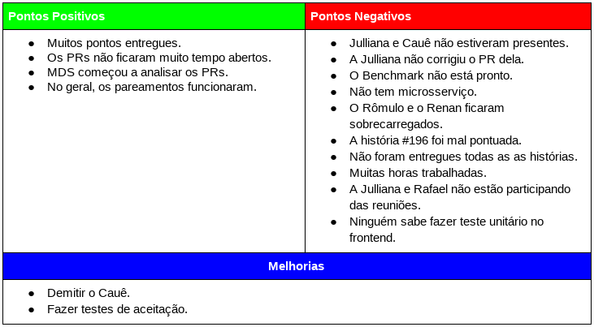

# Resultados da Sprint 09
------

[1. Indicadores de Qualidade do Processo](#1-indicadores-de-qualidade-do-processo)

* [1.1 Fechamento da _Sprint_](#11-fechamento-da-sprint)
* [1.2 _Burndown_](#12-burndown)
* [1.3 Gráfico de _commits_](#13-grafico-de-commits)
* [1.4 _Velocity_](#14-velocity)
* [1.5 Quadro de Horas](#15-quadro-de-horas)
* [1.6 Quadro de Conhecimento](#16-quadro-de-conhecimento)
* [1.7 Melhorias em relação a _Sprint_ 0](#17-melhorias-em-relação-a-sprint-0)
* [1.8 Revisão](#18-revisao-da-sprint)
* [1.9 Retrospectiva](#19-retrospectiva)

[2. Análise do _Scrum Master_](#2-análise-do-scrum-master)  

------

## 1. Indicadores de Qualidade do Processo

### 1.1 Fechamento da _Sprint_

Dos 76 pontos planejados, 40 foram entregues. Apesar da entrega ser maior que nas _Sprints_, não foram entregues todos os pontos, principalmente, por causa dos pontos negativos levantados na [Retrospectiva](#19-retrospectiva)

### 1.2 _Burndown_

### 1.4 _Velocity_

Em relação a _Sprint_ passada, o velocity caiu de 29,43 para 26,43.

### 1.5 Quadro de Horas

### 1.6 Quadro de Conhecimento

### 1.7 Custos

#### Valor Planejado x Custo Real x Valor Agregado 

#### Variação de Custos x Variação de Prazos

#### Índices de Desempenho 

### 1.8 Revisão da _Sprint_

Não houve problemas durante a _Sprint_. Quanto às melhorias foi levantado que os _pull requests_ analisados assim que abertos foi positivo e que os pareamentos foram bons com exceção do Luciano.

### 1.9 Retrospectiva

### 2. Análise do _Scrum Master_

Essa _Sprint_ foi pouco produtiva da equipe e isso é percebido pela queda do velocity, ainda que pequena, e pela quantidade de horas gastas que foi muito abaixo do esperado. Alguns membros estiveram pouco presentes e o time optou pela demissão do Cauê.

Essa demissão ocorreu por causa da ausência constante nos eventos da _Sprint_, falta de comunicação com o time e falta de produção desde a Release 01. O membro foi comunicado de sua demissão e está de acordo com ela.

No mais, foi uma boa Sprint para o time de desenvolvimento que está cada vez mais maduro e também agora com a responsabilidade de analisar _pull requests_.

