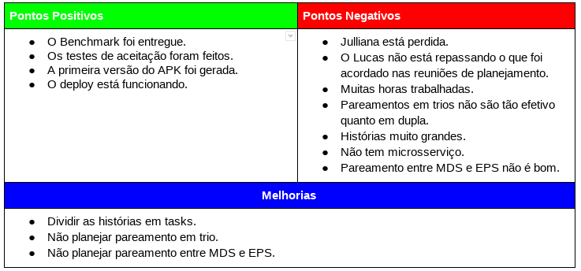

# Resultados da Sprint 10
------

[1. Indicadores de Qualidade do Processo](#1-indicadores-de-qualidade-do-processo)

* [1.1 Fechamento da _Sprint_](#11-fechamento-da-sprint)
* [1.2 _Burndown_](#12-burndown)
* [1.3 Gráfico de _commits_](#13-grafico-de-commits)
* [1.4 _Velocity_](#14-velocity)
* [1.5 Quadro de Horas](#15-quadro-de-horas)
* [1.6 Quadro de Conhecimento](#16-quadro-de-conhecimento)
* [1.7 Revisão](#18-revisao-da-sprint)
* [1.8 Retrospectiva](#19-retrospectiva)

[2. Análise do _Scrum Master_](#2-análise-do-scrum-master)  

------

## 1. Indicadores de Qualidade do Processo

### 1.1 Fechamento da _Sprint_

Dos 60 pontos planejados, 40 foram entregues. Aconteceu de durante a Sprint o time perceber que as histórias eram muito grandes e não seria possível entregá-las, por isso foi decidido dividir algumas histórias. Também houve a necessidade de adiar o fechamento da _Sprint_ para o dia 27 por causa da greve de caminhoneiros.

### 1.2 _Burndown_

### 1.3 Gráfico de _commits_

Abaixo segue o gráfico de _commits_ referente ao frontend do projeto.

Abaixo segue o gráfico de _commits_ referente ao backend do projeto.

### 1.4 _Velocity_

Em relação a _Sprint_ passada, o velocity subiu de 26,43 para 28,71.

### 1.5 Quadro de Horas

### 1.6 Quadro de Conhecimento

### 1.7 Custos

#### Valor Planejado x Custo Real x Valor Agregado

#### Variação de Custos x Variação de Prazos

#### Índices de Desempenho 

### 1.8 Revisão da _Sprint_

Nessa _Sprint_ houve dois problemas:

* O Travis, no backend, não estava funcionando corretamente, pois não conseguia rodas as migrations e isso atrasou a análise dos PRs. Porém o Luis conseguiu arrumar.
* Dificuldades para gerar o APK que atrasou a história do Rômulo e da Sara, pois eles não conseguiram testar a aplicação no celular. O Luis conseguiu gerar o APK e os ajudou a gerá-lo.

### 1.9 Retrospectiva

### 2. Análise do _Scrum Master_

Essa foi uma boa _Sprint_, em relação as anteriores. O _Velocity_ voltou a subir e isso foi possível pela quebra das histórias, porém os membros ainda estão trabalhando muitas horas, o que mostra que a produtividade ainda está baixa.

Finalmente nessa _Sprint_ o Benchmark foi entregue e o deploy do backend está funcionando (faltando apenas automatizá-lo e configurar o deploy do front). Essas entregas foram possíveis graças a um empenho maior do Luis para entregá-las.

Nas próximas _Sprints_ é necessário dar mais atenção a Julliana, porque ela está um pouco perdida no projeto e isso se dá, principalmente, pela falta de participação nos eventos da _Sprint_.

