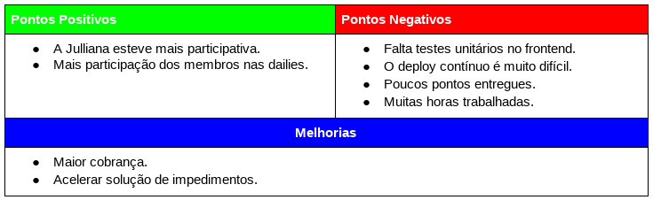

# Resultados da Sprint 11
------

[1. Indicadores de Qualidade do Processo](#1-indicadores-de-qualidade-do-processo)

* [1.1 Fechamento da _Sprint_](#11-fechamento-da-sprint)
* [1.2 _Burndown_](#12-burndown)
* [1.3 Gráfico de _commits_](#13-grafico-de-commits)
* [1.4 _Velocity_](#14-velocity)
* [1.5 Quadro de Horas](#15-quadro-de-horas)
* [1.6 Quadro de Conhecimento](#16-quadro-de-conhecimento)
* [1.7 Melhorias em relação a _Sprint_ 0](#17-melhorias-em-relação-a-sprint-0)
* [1.8 Revisão](#18-revisao-da-sprint)
* [1.9 Retrospectiva](#19-retrospectiva)

[2. Análise do _Scrum Master_](#2-análise-do-scrum-master)  

------

## 1. Indicadores de Qualidade do Processo

### 1.1 Fechamento da _Sprint_

 Dos 36 pontos planejados, 14 foram entregues. Essa baixa entrega de pontos se deu pela dificuldade das histórias e falta de testes. 

### 1.2 _Burndown_

### 1.4 _Velocity_

 Em relação a _Sprint_ passada, o velocity caiu de 28,71 para 24. 

### 1.5 Quadro de Horas

### 1.6 Quadro de Conhecimento

### 1.7. Custos

#### Valor Planejado x Custo Real x Valor Agregado

#### Variação de Custos x Variação de Prazos

#### Índices de Desempenho

### 1.7 Revisão da _Sprint_

Nessa _Sprint_ houve dois problemas: 

<ul align="justify">
<li> Alguns PRs antigos não foram analisados/corrigidos o que atrasou algumas histórias.
<li> As métricas de códigos não estavam disponíveis.
</ul>

### 1.8 Retrospectiva

### 2. Análise do _Scrum Master_

 Essa foi uma _Sprint_ ruim, devido à baixa entrega. O velocity caiu bastante e isso é um problema para o projeto, pois mostra que a produtividade está baixa. 

 Não houve uma diferença significativa no quadro de conhecimentos. A falta de alguém que saiba fazer testes unitários em typescript é um grande problema e risco para o projeto. 

 Apesar disso os membros estiveram mais presentes nas dailies, o que ajudou na transparência e a Julliana parece estar menos perdida. 

