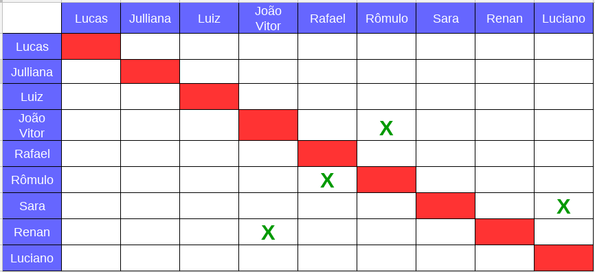
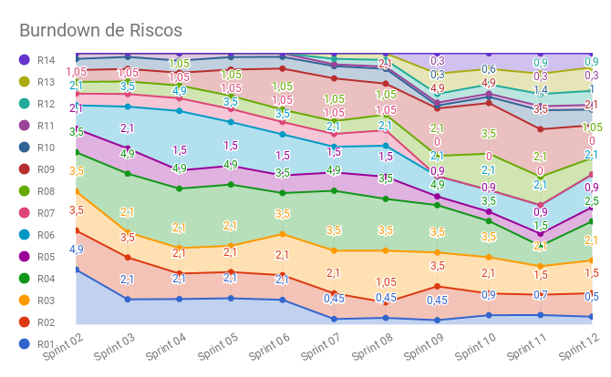

# Planejamento da Sprint 12

**Data de Início:** 02/06/2018  

**Data de Término:** 09/06/2018

**Duração:** Uma semana

**Pontos Planejados**: 22

**Pontos Adicionados**: 16

**Pontos Totais**: 40

-------

[1. Pareamento](#1-pareamento)

[2. Mudanças](#2-mudanças)

[3. Priorização](#3-priorizacao)

[4. Burndown de Riscos](#4-burndown-de-riscos)

[5. Features da _Sprint_](#5-features-da-sprint)

-------
## 1. Pareamento

## 2. Mudanças

Para essa _Sprint_ foram levantadas as melhorias:

* Acelerar solução de impedimentos.
* Maior cobrança do time, por parte do Scrum Master.

## 3. Priorização

A priorização das _features_ foi feita na necessidade de entregar valor para o cliente, sanar algumas dívidas técnicas e melhorar a usabilidade do produto.

## 4. Burndown de Riscos

A  tabela a seguir lista todos os riscos que foram identificados para essa _Sprint_, a probabilidade deles ocorrerem, quantos dias serão perdidos caso o risco ocorra e a exposição ao risco que é calculado multiplicando a probabilidade do risco pelo tamanho da perda.

| # | Descrição | Probabilidade do Risco |Tamanho da Perda (dias)|Exposição ao Risco|
| :--- | :------------- | :------------- | :------------- | :------------- |
| 01 | Incompatibilidade de horários para reuniões  | 50%  | 1  | 0,5 |
| 02 | Features má pontuadas  | 30%  | 5 | 1,5  |
| 03 | Baixa produtividade  | 30%  | 7  | 2,1 |
| 04 | Mais pontos planejados do que o time é capaz de entregar  | 50%  | 5 | 2,5  |
| 05 | Dificuldades com a tecnologia de desenvolvimento  | 30%  | 3  | 0,9 |
| 06 | Erros na implementação de Features  | 30%  | 7  |  2,1 |
| 07 | Features mal documentadas   | 0%  | 7  | 0  |
| 08 | Quebra ou furto de equipamentos da equipe   | 15%  | 7 | 1,05  |
| 09 | Desistência de algum membro       | 30% | 7 | 2,1|
| 10 | Problemas na configuração do ambiente de desenvolvimento  | 50%  |  2 | 1 |
| 11 | Dificuldade de se reunir com o cliente   | 30%  | 1  | 0,3  |
| 12 | Indisponibilidade dos membros de MDS  | 30% | 3 | 0,9 |
| 13 | Indisponibilidade dos membros de EPS  | 50% | 3 | 1,5|
| 14 | Falta de comunicação | 30% | 3 | 0,9 |
|   |   |   | Exposição:  | 17,35 |

Abaixo é mostrado o _Burndown_ de riscos das _Sprints_.

## 5. Features da _Sprint_
* <a href="https://github.com/fga-gpp-mds/2018.1-Lacos-da-Alegria/issues/64">[#65] Deploy contínuo </a>
* <a href="https://github.com/fga-gpp-mds/2018.1-Lacos-da-Alegria/issues/216">[#216] Voluntário se inscrever em uma atividade (frontend) </a>
* <a href="https://github.com/fga-gpp-mds/2018.1-Lacos-da-Alegria/issues/152">[#152] Implementar sorteio para voluntários </a>
* <a href="https://github.com/fga-gpp-mds/2018.1-Lacos-da-Alegria/issues/218">[#218] Implementar restrição de permissões </a>
* <a href="https://github.com/fga-gpp-mds/2018.1-Lacos-da-Alegria/issues/222">[#222] Documentar resultados da Sprint 10 </a>
* <a href="https://github.com/fga-gpp-mds/2018.1-Lacos-da-Alegria/issues/230">[#230] Deletar usuário </a>
* <a href="https://github.com/fga-gpp-mds/2018.1-Lacos-da-Alegria/issues/231">[#231] Documentar resultados da Sprint 11 </a>
* <a href="https://github.com/fga-gpp-mds/2018.1-Lacos-da-Alegria/issues/232">[#232] Documentar planejamento da Sprint 12 </a>
* <a href="https://github.com/fga-gpp-mds/2018.1-Lacos-da-Alegria/issues/233">[#233] Refatorar CSS - páginas de entrada </a>
* <a href="https://github.com/fga-gpp-mds/2018.1-Lacos-da-Alegria/issues/234">[#234] CCS - páginas depois do login </a>
