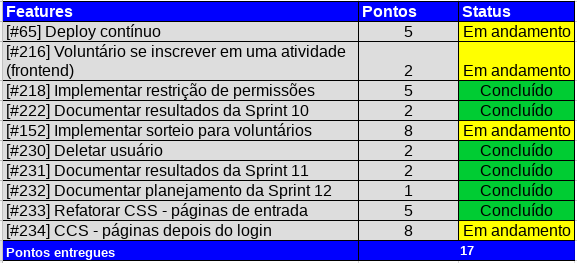
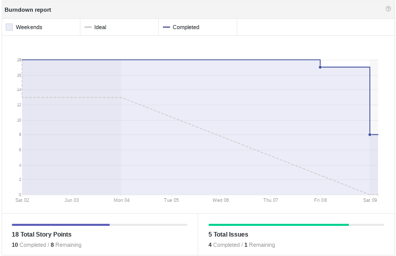
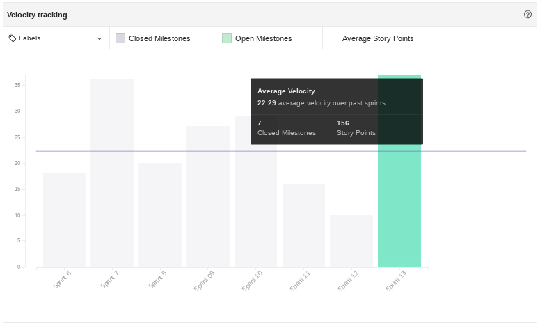
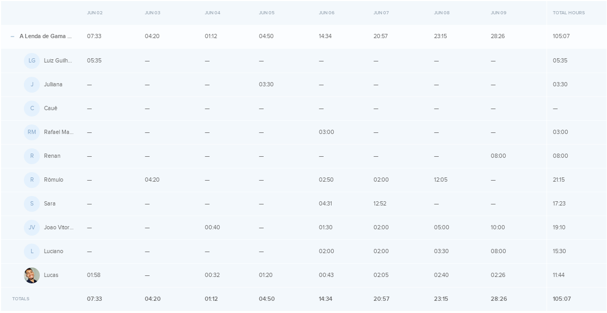
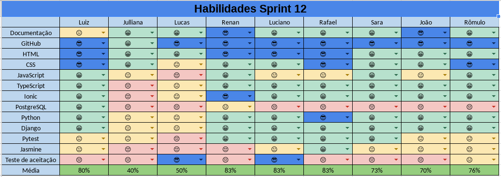
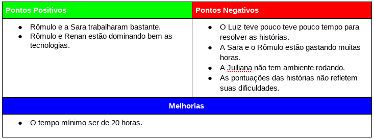
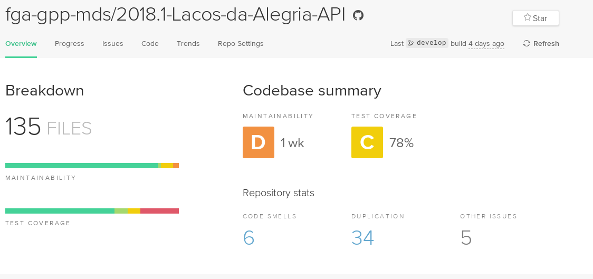

# Resultados da Sprint 12
------

[1. Indicadores de Qualidade do Processo](#1-indicadores-de-qualidade-do-processo)

* [1.1 Fechamento da _Sprint_](#11-fechamento-da-sprint)
* [1.2 _Burndown_](#12-burndown)
* [1.3 Gráfico de _commits_](#13-grafico-de-commits)
* [1.4 _Velocity_](#14-velocity)
* [1.5 Quadro de Horas](#15-quadro-de-horas)
* [1.6 Quadro de Conhecimento](#16-quadro-de-conhecimento)
* [1.7 Melhorias em relação a _Sprint_ 0](#17-melhorias-em-relação-a-sprint-0)
* [1.8 Revisão](#18-revisao-da-sprint)
* [1.9 Retrospectiva](#19-retrospectiva)

[2. Indicadores de Qualidade do Produto](#2-indicadores-de-qualidade-do-produto)

[3. Análise do _Scrum Master_](#3-análise-do-scrum-master)  

------

## 1. Indicadores de Qualidade do Processo

### 1.1 Fechamento da _Sprint_

 Dos 40 pontos planejados, 17 foram entregues. 

### 1.2 _Burndown_

### 1.4 _Velocity_

 Em relação a _Sprint_ passada, o velocity caiu de 24 para 22,29. 

### 1.5 Quadro de Horas

### 1.6 Quadro de Conhecimento

### 1.7 EVM

#### Valor Planejado x Custo Real x Valor Agregado 

#### Variação de Custos x Variação de Prazos 

#### Índices de Desempenho 

### 1.8 Análise do Tracker
Na décima segunda Sprint foram planejados 17 pontos, além dos 23 pontos adicionados, no entanto foram feitos apenas  17 pontos. Na visão do cliente, o projeto deveria estar com 86,67% do projeto inteiro, como não foram entregues todos os pontos, foram entregues apenas 79,70%. Para ver EVM completa acesse o link: [evm](https://docs.google.com/spreadsheets/d/1UhuJbHicONbdPg4TTNmiDS6sEkknskACSvgKSooy36A/edit#gid=0)

### 1.9 Revisão da _Sprint_

Nessa _Sprint_ houve dois problemas: 

<ul align="justify">
<li> Existe um bug que depois que usuário faz logout é possível voltar ao aplicativo tocando no botão voltar do celular. </li>
<li> Usar a API de sorteio, por causa da linguagem em que foi escrita. Por isso foi decidido não usar. </li>
</ul>

### 2 Retrospectiva

## 2.1 Indicadores de Qualidade do Produto

### 2.1.1 Backend

 O Backend possui: 

<ul align="justify">
<li> 34 duplicações de código; </li>
<li> 78% de cobertura de testes, que está crítico e é necessário um foco maior para alcançar os 90%. </li>
</ul>

### 3. Análise do _Scrum Master_

 A queda do _Velocity_ é um problema recorrente e por isso foi decidido que na próxima _Sprint_ a quantidade de horas mínimas aumentaria para 20. 

 A situação atual do projeto é preocupante, pois o time está com algumas dívidas técnicas acumuladas e o prazo para a entrega do produto está acabando. Existe um problema também em que nem todas as métricas de código estão disponíveis. 

