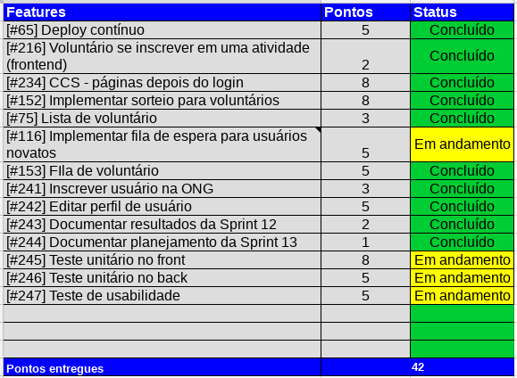
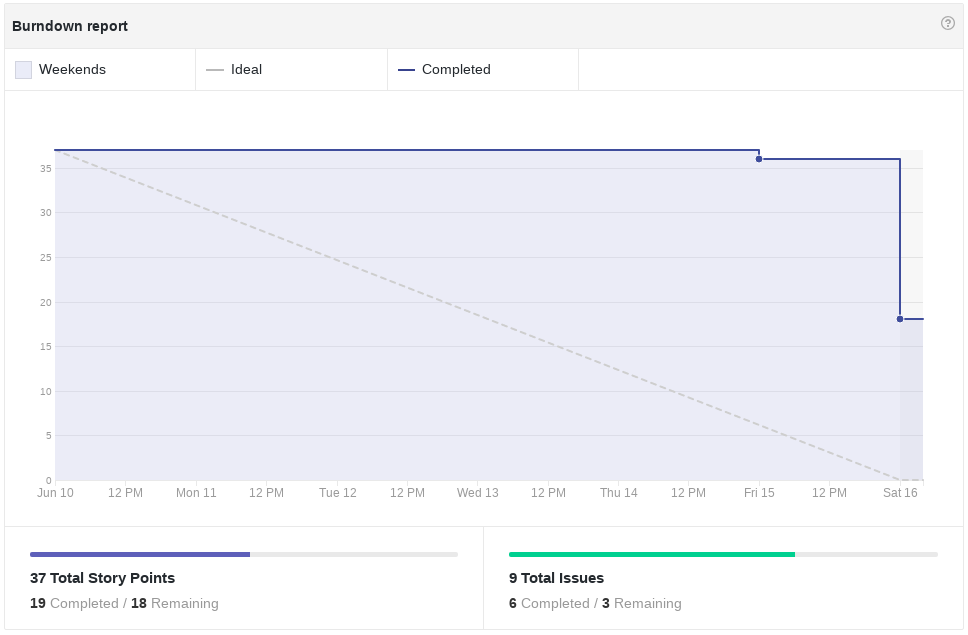
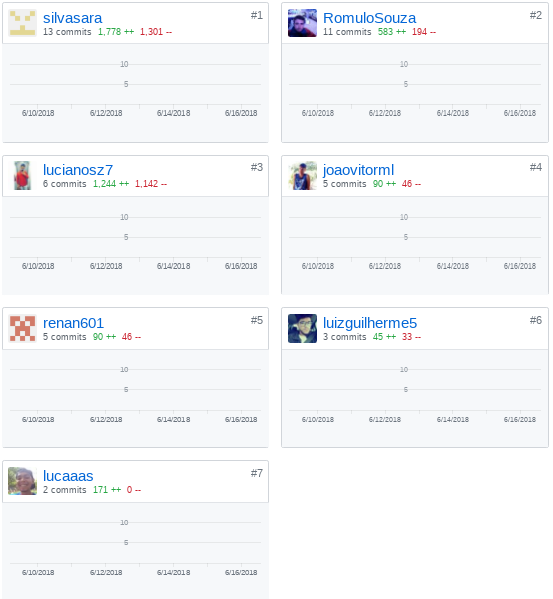
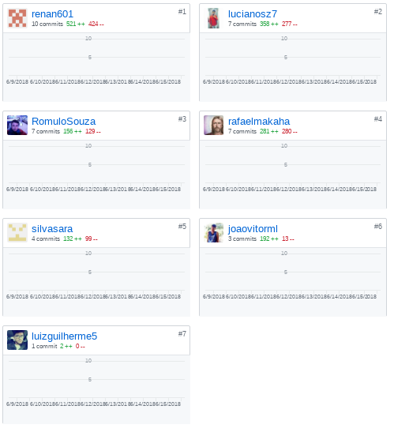
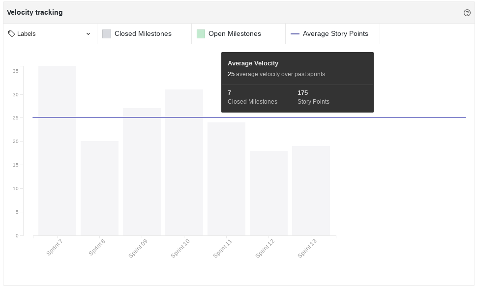
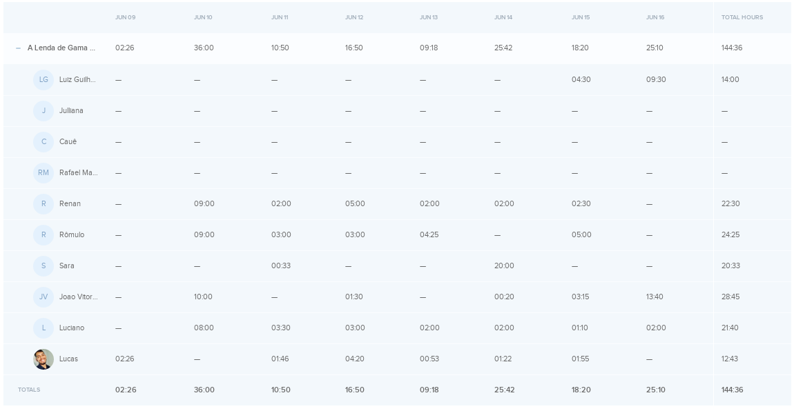
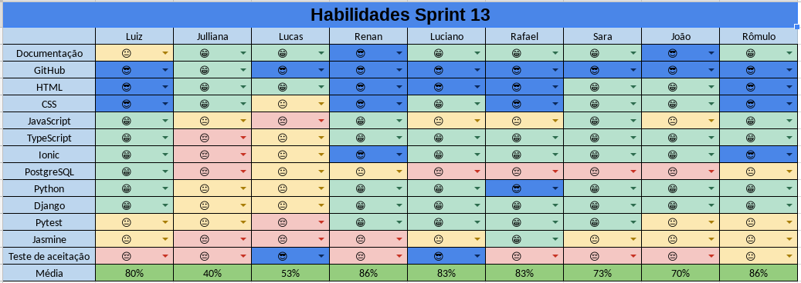
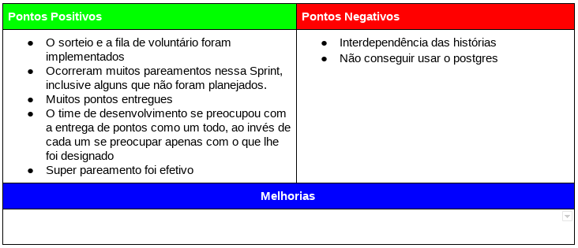
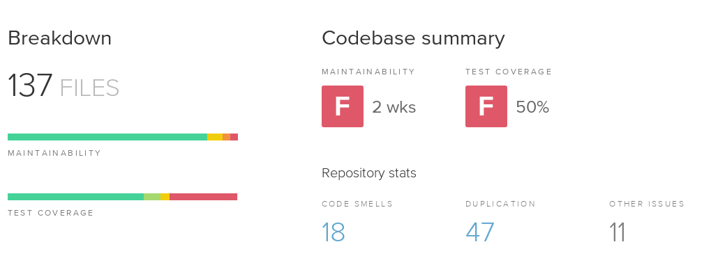

# Resultados da Sprint 13
------

[1. Indicadores de Qualidade do Processo](#1-indicadores-de-qualidade-do-processo)

* [1.1 Fechamento da _Sprint_](#11-fechamento-da-sprint)
* [1.2 _Burndown_](#12-burndown)
* [1.3 Gráfico de _commits_](#13-grafico-de-commits)
* [1.4 _Velocity_](#14-velocity)
* [1.5 Quadro de Horas](#15-quadro-de-horas)
* [1.6 Quadro de Conhecimento](#16-quadro-de-conhecimento)
* [1.7 Melhorias em relação a _Sprint_ 0](#17-melhorias-em-relação-a-sprint-0)
* [1.8 Revisão](#18-revisao-da-sprint)
* [1.9 Retrospectiva](#19-retrospectiva)

[2. Indicadores de Qualidade do Produto](#2-indicadores-de-qualidade-do-produto)

[3. Análise do _Scrum Master_](#3-análise-do-scrum-master)  

------

## 1. Indicadores de Qualidade do Processo

### 1.1 Fechamento da _Sprint_

 Dos 65 pontos planejados, 42 foram entregues. 

### 1.2 _Burndown_

### 1.3 Gráfico de _commits_

Abaixo segue o gráfico de _commits_ referente ao frontend do projeto.

Abaixo segue o gráfico de _commits_ referente ao backend do projeto.

### 1.4 _Velocity_

 Em relação a _Sprint_ passada, o velocity subiu de 22,29 para 25. 

### 1.5 Quadro de Horas

### 1.6 Quadro de Conhecimento

### 1.7 Revisão da _Sprint_

Nessa _Sprint_ houve dois problemas: 

<ul align="justify">
  <li> O ambiente de testes unitários no frontend está quebrado e por isso não foi possível elaborá-los. </li>
  <li> A função de mostrar a posição do usuário na fila não estava implementada, impossibilitando a execução do teste de usabilidade. </li>
</ul>

## 1.8 Custos

#### Valor Planejado x Custo Real x Valor Agregado

#### Variação de Custos x Variação de Prazos

#### Índices de Desempenho

### 1.9 Análise do Tracker
Na décima terceira Sprint foram planejados 42 pontos, além dos 23 pontos adicionados, no entanto foram feitos 42 pontos. Na visão do cliente, o projeto deveria estar com 93,33% do projeto inteiro, como não foram entregues todos os pontos, foram entregues apenas 88,58%. Para ver EVM completa acesse o link: [evm](https://docs.google.com/spreadsheets/d/1UhuJbHicONbdPg4TTNmiDS6sEkknskACSvgKSooy36A/edit#gid=0)

### 2 Retrospectiva

## 2. Indicadores de Qualidade do Produto

### 2.1 Backend

 O Backend possui: 

<ul align="justify">
  <li> 47 duplicações de código; </li>
  <li> 50% de cobertura de testes, que está crítico e é necessário um foco maior para alcançar os 90%. </li>
</ul>

### 3. Análise do _Scrum Master_

 Essa _Sprint_ teve alguns pontos positivos interessantes. A união do time de desenvolvimento para entregar as histórias foi importante para a alta entrega de pontos e é bom ver que eles não se preocuparam apenas com as próprias e sim com a entrega de tudo. Estão realmente pensando como um time e perceberam que precisam se ajudar para entregar o produto no prazo e com qualidade. 

 A interdependência das histórias foi um problema para eles, mas de certa forma foi bom, pois foi o que incentivou essa união.

 Apesar de o velocity ter subido nessa _Sprint_ (algo que não acontecia a algum tempo), ele ainda está baixo e, junto com a grande quantidade de horas trabalhadas, significa que o time ainda não alcançou a produtividade. O conhecimento do time subiu (resultado dos pareamentos), porém o conhecimento em testes de aceitação ainda estão muito concentrados e é necessário disseminá-lo entre os outros membros. 

