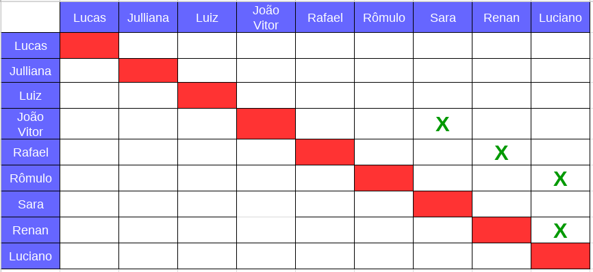
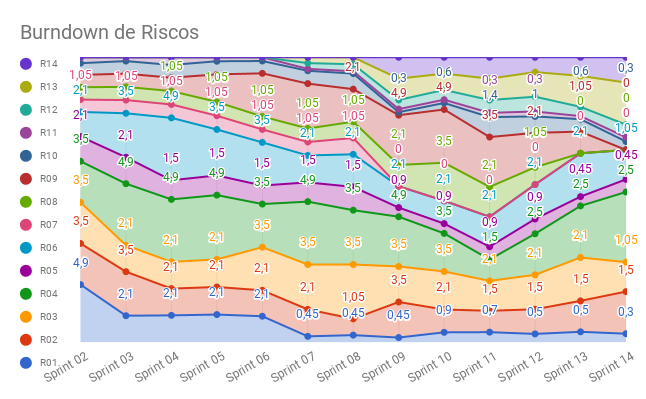

# Planejamento da Sprint 14

**Data de Início:** 17/06/2018  

**Data de Término:** 25/06/2018

**Duração:** Nove dias

**Pontos Planejados**: 30

**Pontos Adicionados**: 23

**Pontos Totais**: 53

-------

[1. Pareamento](#1-pareamento)

[2. Mudanças](#2-mudanças)

[3. Priorização](#3-priorizacao)

[4. Burndown de Riscos](#4-burndown-de-riscos)

[5. Features da _Sprint_](#5-features-da-sprint)

-------
## 1. Pareamento

## 2. Mudanças

 Nessa _Sprint_ não foi levantada nenhuma melhoria. 

## 3. Priorização

 A priorização das _features_ foi feita na necessidade de entregar valor para o cliente, sanar algumas dívidas técnicas e garantir a qualidade produto. 

## 4. Burndown de Riscos

 A  tabela a seguir lista todos os riscos que foram identificados para essa _Sprint_, a probabilidade deles ocorrerem, quantos dias serão perdidos caso o risco ocorra e a exposição ao risco que é calculado multiplicando a probabilidade do risco pelo tamanho da perda. 

| # | Descrição | Probabilidade do Risco |Tamanho da Perda (dias)|Exposição ao Risco|
| :--- | :------------- | :------------- | :------------- | :------------- |
| 01 | Incompatibilidade de horários para reuniões  | 30%  | 1  | 0,3 |
| 02 | Features má pontuadas  | 30%  | 5 | 1,5 |
| 03 | Baixa produtividade  | 15%  | 7  | 1,05 |
| 04 | Mais pontos planejados do que o time é capaz de entregar  | 50%  | 5 | 2,5  |
| 05 | Dificuldades com a tecnologia de desenvolvimento  | 15%  | 3  | 0,45 |
| 06 | Erros na implementação de Features  | 15%  | 7  |  1,05 |
| 07 | Features mal documentadas   | 0%  | 7  | 0  |
| 08 | Quebra ou furto de equipamentos da equipe   | 0%  | 7 | 0 |
| 09 | Desistência de algum membro       | 0% | 7 | 0 |
| 10 | Problemas na configuração do ambiente de desenvolvimento  | 15%  |  2 | 0,3 |
| 11 | Dificuldade de se reunir com o cliente   | 15%  | 1  | 0,15  |
| 12 | Indisponibilidade dos membros de MDS  | 15% | 3 | 0,45 |
| 13 | Indisponibilidade dos membros de EPS  | 50% | 3 | 1,5 |
| 14 | Falta de comunicação | 30% | 3 | 0,9 |
|   |   |   | Exposição:  | 10,15 |

 Abaixo é mostrado o _Burndown_ de riscos das _Sprints_. 

## 5. Features da _Sprint_

<ul align="justify">

  <li> <a href="https://github.com/fga-gpp-mds/2018.1-Lacos-da-Alegria/issues/116">[#116] Implementar fila de espera para usuários novatos</a> </li>
  <li> <a href="https://github.com/fga-gpp-mds/2018.1-Lacos-da-Alegria/issues/245">[#245] Teste unitário no front</a> </li>
  <li> <a href="https://github.com/fga-gpp-mds/2018.1-Lacos-da-Alegria/issues/246">[#246] Teste unitário no </a> </li>
  <li> <a href="https://github.com/fga-gpp-mds/2018.1-Lacos-da-Alegria/issues/247">[#247] Teste de usabilidade</a> </li>
  <li> <a href="https://github.com/fga-gpp-mds/2018.1-Lacos-da-Alegria/issues/263">[#263] Documentar resultados da Sprint 13 </a> </li>
  <li> <a href="https://github.com/fga-gpp-mds/2018.1-Lacos-da-Alegria/issues/264">[#264] Documentar planejamento da Sprint 14 </a> </li>
  <li> <a href="https://github.com/fga-gpp-mds/2018.1-Lacos-da-Alegria/issues/156">[#156] Sistema de notificação </a> </li>
  <li> <a href="https://github.com/fga-gpp-mds/2018.1-Lacos-da-Alegria/issues/260">[#260] Tela de detalhes da atividades </a> </li>
  <li> <a href="https://github.com/fga-gpp-mds/2018.1-Lacos-da-Alegria/issues/155">[#155] Lista de Apoios </a> </li>
  <li> <a href="https://github.com/fga-gpp-mds/2018.1-Lacos-da-Alegria/issues/261">[#261] Atividades antigas sendo mostradas </a> </li>
  <li> <a href="https://github.com/fga-gpp-mds/2018.1-Lacos-da-Alegria/issues/262">[#262] Refresh de atividades </a> </li>
</ul>
