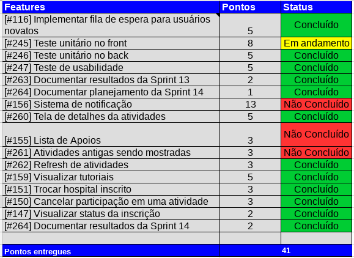
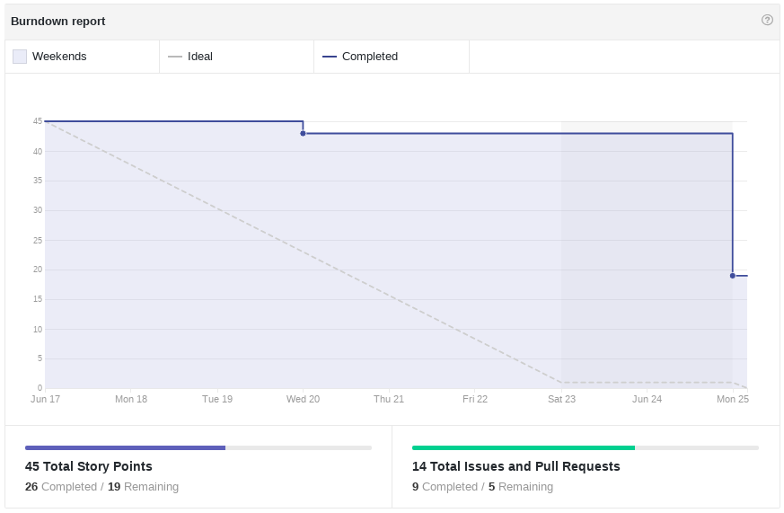
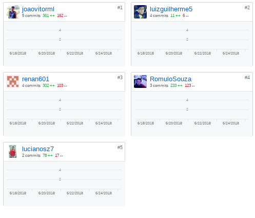
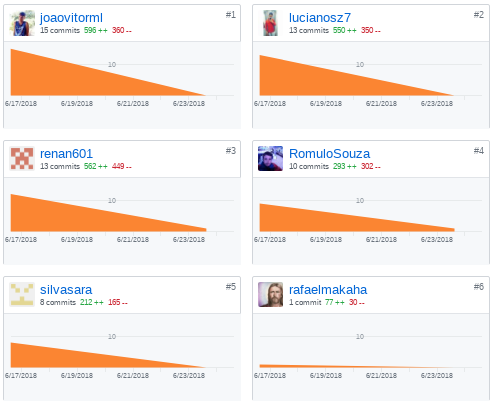
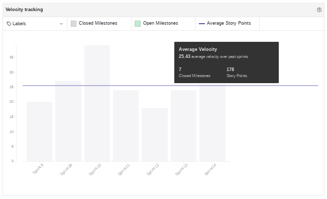
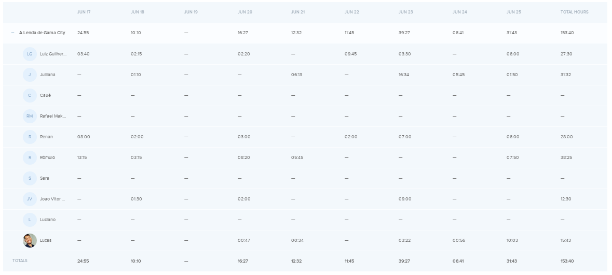
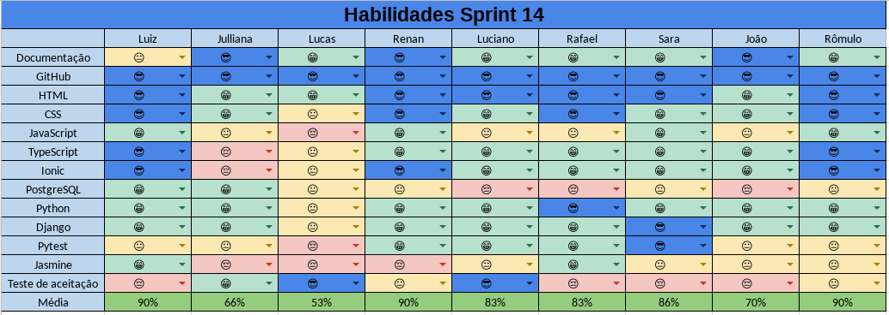
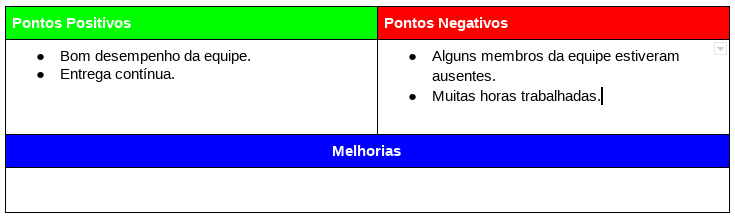
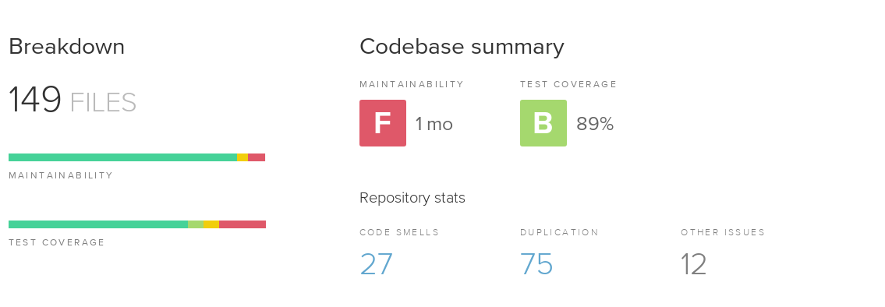

# Resultados da Sprint 14
------

[1. Indicadores de Qualidade do Processo](#1-indicadores-de-qualidade-do-processo)

* [1.1 Fechamento da _Sprint_](#11-fechamento-da-sprint)
* [1.2 _Burndown_](#12-burndown)
* [1.3 Gráfico de _commits_](#13-grafico-de-commits)
* [1.4 _Velocity_](#14-velocity)
* [1.5 Quadro de Horas](#15-quadro-de-horas)
* [1.6 Quadro de Conhecimento](#16-quadro-de-conhecimento)
* [1.7 Melhorias em relação a _Sprint_ 0](#17-melhorias-em-relação-a-sprint-0)
* [1.8 Revisão](#18-revisao-da-sprint)
* [1.9 Retrospectiva](#19-retrospectiva)

[2. Indicadores de Qualidade do Produto](#2-indicadores-de-qualidade-do-produto)

[3. Análise do _Scrum Master_](#3-análise-do-scrum-master)  

------

## 1. Indicadores de Qualidade do Processo

### 1.1 Fechamento da _Sprint_

 Dos 53 pontos planejados, 41 foram entregues. Durante a Sprint foi necessário acrescentar algumas histórias para garantir a entrega do produto. 

### 1.2 _Burndown_

### 1.3 Gráfico de _commits_

Abaixo segue o gráfico de _commits_ referente ao frontend do projeto.

Abaixo segue o gráfico de _commits_ referente ao backend do projeto.

### 1.4 _Velocity_

 Em relação a _Sprint_ passada, o velocity subiu de 25 para 25,43. 

### 1.5 Quadro de Horas

### 1.6 Quadro de Conhecimento

### 1.7 Revisão da _Sprint_

 Não houveram problemas nessa Sprint 

### 1.8 Retrospectiva

## 2. Indicadores de Qualidade do Produto

### 2.1 Backend

 O Backend possui: 

<ul align="justify">
  <li> 75 duplicações de código; </li>
  <li> 90% de cobertura de teste. </li>
</ul>

### 3. Análise do _Scrum Master_

 Essa foi a última Sprint do projeto. Foi uma boa Sprint, a qualidade do código subiu, a cobertura de código finalmente subiu para 90%. Aconteceu de alguns membros não estarem muito presentes, mas isso não causou impactos significativos. 

 A adição de novas histórias mostrou uma falha no planejamento, mas, felizmente, não causou impactos negativos. No final, as histórias mais importantes foram entregues. 

