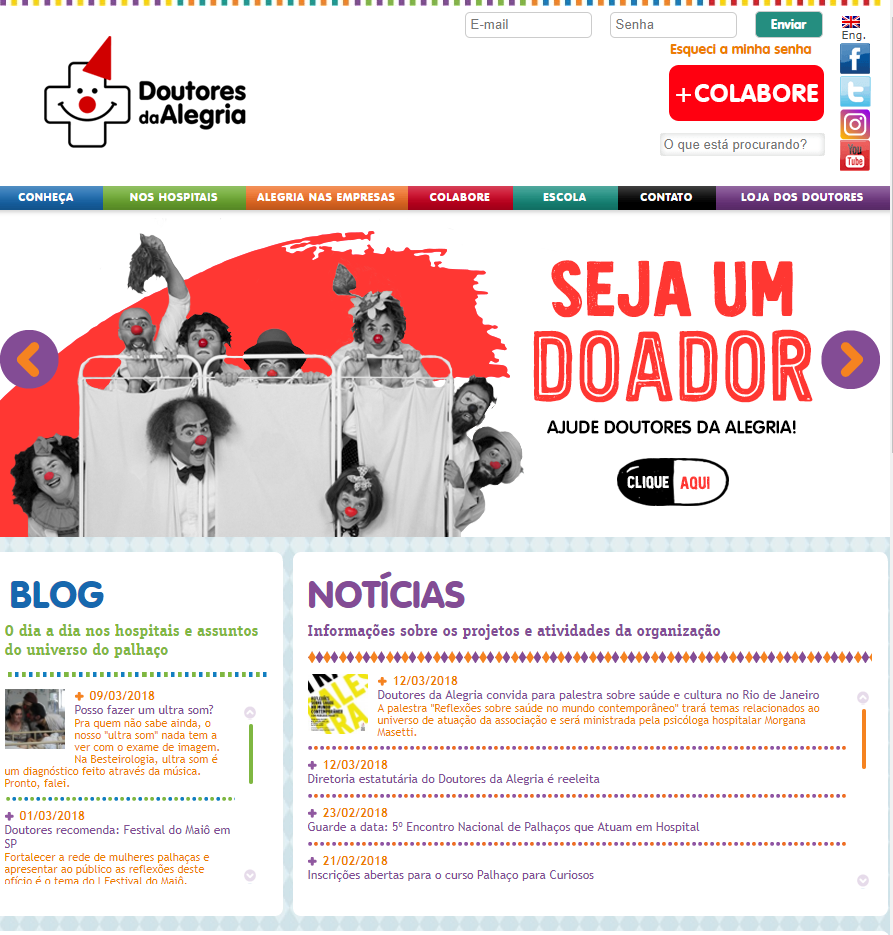
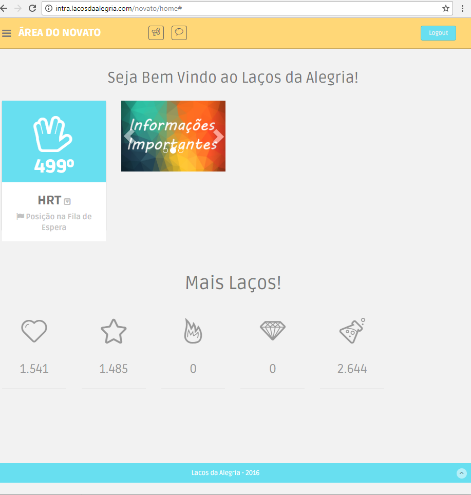

# Documento de Visão

## Histórico de Versão
| Data | Versão | Descrição | Autor |
| :--- | :--- | :--- | :--- |
| 17/03 | 0.1 | Adicionados tópicos 1, 4 e 5  | Rafael Makaha |
| 17/03 | 0.2 | Adicionados tópicos 2, 3 e 5  | Renan Schadt |
| 18/03 | 1.0 | Revisão tópicos 1 à 5         | Julliana do Couto Almeida |
| 25/03 | 1.1 | Revisão Markdown, referências na ABNT e imagens adicionadas | Renan Schadt |
| 10/04 | 1.2 | Tópico 5 refatorado, sumário adicionado | Renan Schadt |

## Sumário
[1. Introdução](#1-introdução)

* [1.1 Sobre a Organização](#11-sobre-a-organização)
* [1.2 Objetivos](#12-objetivos)
* [1.3 Visão Geral da Solução](#13-visão-geral-da-solução)

[2. Descrição do Usuário](#2-descrição-do-usuário)

* [2.1 Tipos de Usuário](#21-tipos-de-usuário)
* [2.2 Principais Necessidades do Usuário](#22-principais-necessidades-do-usuário)
* [2.3 Ambiente do Usuário](#23-ambiente-do-usuário)
* [2.4 Alternativas e Competição](#24-alternativas-e-competiçãok)

[3. Envolvidos](#3-envolvidos)

[4. Visão Geral do Produto](#4-visão-geral-do-produto)

* [4.1 Perspectiva do Produto](#41-perspectiva-do-produto)
* [4.2 Declaração de Posição do Produto](#42-declaração-de-posição-do-produto)

[5. Recursos do Produto](#5-recursos-do-produto)

[6. Referências](#6-referências)

## 1. Introdução
Este documento tem o propósito de apresentar o escopo em alto nível do aplicativo. A Laços da Alegria, trata-se de uma ONG que promove visitas voluntárias a hospitais e organizações sem fins lucrativos para levar alegria e descontração aos pacientes. Com intuito de proporcionar um maior contato com os voluntários, surgiu a ideia de instituir o aplicativo na ONG.

### 1.1 Sobre a Organização
De acordo com a psicóloga Dayana Lima Dantas Valverde (2010), “Embora a palavra hospital venha da palavra hospitalidade, muitos pacientes não o consideram como local hospedeiro. O bem estar psicológico do paciente não é o principal objetivo do atendimento e sim prestar socorro àquele que tem um sofrimento relacionado com o biológico e orgânico”.

É a partir disso que a Laços da Alegria age para tratar do bem estar mental e social dos pacientes de hospitais. Os voluntários vão de corações abertos para as visitações a fim de proporcionar boa companhia para os presentes nos locais visitados. Os voluntários fazem as visitas caracterizados e proporcionam abordagens diferenciadas levando-se em consideração a cultura regional. Tendo como exemplo as “piadas” ocorridas em um local, podem não ser bem recebidas em um outro. Assim, são tomados cuidados especiais em cada visitação.

As visitas ocorrem em grupos de cerca de 20 pessoas, as quais são subdivididas em grupos de voluntários - que já realizaram sua primeira visita -, apoio - são responsáveis pela interação inicial com os pacientes - e novatos - que estão fazendo sua primeira visita. Atualmente a ONG Laços da Alegria proporciona suas visitas a 7 hospitais em todo o Distrito Federal. As visitas a hospitais ocorrem semanalmente e quinzenalmente às outras organizações. Por ser uma organização sem fins lucrativos, não são cobradas taxas para participar ou promover o projeto.

### 1.2 Objetivos
Este projeto tem como objetivo principal ser o facilitador para a organização das visitações feitas pela Laços da Alegria aos hospitais e instituições. Esta aplicação mobile servirá de base para a melhoria do sistema atual da Laços da Alegria.

O atual website da Laços da Alegria não informa sobre o andamento das filas de espera dos voluntários. Isso gera frustração nos voluntários, pois, por exemplo, se um voluntário de uma fila cancela sua participação, o próximo da fila tem sua vaga garantida, porém não é notificado da chegada de sua vez na fila. Com esta aplicação, as notificações serão enviadas, informando e atualizando os voluntários.

### 1.3 Visão Geral da Solução
O propósito da aplicação mobile a ser desenvolvida é de gerenciar o sistema de visitas aos hospitais, na qual o usuário do aplicativo pode entrar na fila de espera para realizar visita em um determinado hospital de sua preferência.

O sistema irá prover gerenciamento da fila de espera para novatos, voluntários e equipe de apoio - cada um destes contando com uma fila exclusiva - em cada hospital ou instituição parceiros da Laços da Alegria.

Além das funcionalidades já citadas, o aplicativo permitirá o cadastro/login de usuários, enviando notificações quando necessário e tendo integração nativa com o calendário do celular, entre outras funcionalidades menores.

| O problema da| Ineficiência da página atual em atualizar os usuários sobre andamento da fila por ausência de notificações|
| :--- | :---: |
| Afeta | Os voluntários da Laços da Alegria. |
| Cujo impacto é | esquecimento da data de visita e falta por não saber que fora convocado para a visitação. |
| Uma boa solução seria | Um aplicativo que envie notificações conforme o andamento da fila e marque o horário da visita no calendário nativo do sistema operacional utilizado pelo usuário. |

## 2. Descrição do Usuário
Os usuários do aplicativo serão moradores do Distrito Federal e seu entorno, principalmente das cidades onde a Laços da Alegria atua com seus projetos. A idade média dos usuários é de 18 a 25 anos.

### 2.1 Tipos de Usuário
|Tipo | Descrição | Restrição de Acesso |
| :--- | :--- | :--- |
| Novatos | Ainda não fez sua primeira visita | Não tem acesso a aba insitituições, nem a lista de inscritos nas atividades |
| Voluntários | Já fez sua primeira visita |
| Equipe de Apoio | Coordenam a visita e auxiliam os novatos |

### 2.2 Principais Necessidades do Usuário
| Necessidade | Prioridade | Interesses | Solução atual | Solução proposta
| --- | --- | --- | --- | --- |
| Inscrição em eventos de visitação. | Alta. | Manter o controle contínuo dos voluntários envolvidos nas visitações. |Website pouco organizado. |Promover as inscrições por meio de uma aplicação mobile de fácil utilização.
|Notificar os voluntários. | Alta. | Manter os voluntários informados a respeito da sua situação nas filas. | O usuário deve continuamente verificar o website para saber sua situação na fila. | A aplicação mobile irá notificar continuamente o usuário sobre sua posição na fila inscrita.

### 2.3 Ambiente do Usuário
O aplicativo será desenvolvido para aumentar a comodidade dos usuários e notificá-los das suas visitas, estará presente no Android e IOS, necessita-se que o usuário tenha acesso a internet.

### 2.4 Alternativas e Competição
Nesta seção são descritos competidores ou alternativas ao aplicativo que está sendo criado.

#### 2.4.1 Doutores da Alegria
 Figura 1 - Home page do site da Doutores da Alegria  

Uma fundação cujo objetivo é visitar crianças e adolescentes internados, a equipe é composta por cerca de 40 artistas profissionais que se vestem de palhaços para entreter seu público e realizam atividades semanais em 12 hospitais de Recife e São Paulo.

A fundação sobrevive e paga os artistas através de doações de empresas ou qualquer outro interessado, apesar de ser gratuito para os hospitais e pacientes, o trabalho não é voluntário.

#### 2.4.2 Hospitalhaços
 Figura 2 - Home page da Hospitalhaços  

Uma ONG criada em 1999 que utiliza a figura de palhaços para levar sorrisos ao ambiente hospitalar. Conta com mais de 600 voluntários ativos atuando nos estados de São Paulo e Pernambuco. Antes de se tornar um voluntário é preciso passar por um processo seletivo e um treinamento. Conta com uma página web em funcionamento e um aplicativo em estágio de desenvolvimento.

#### 2.4.3 Site da Laços da Alegria
 Figura 3 - Página exibida aos novatos no site Laços da Alegria  

É o meio pela qual as visitas relacionadas a Laços da Alegria são agendadas atualmente. Permite cadastro/login, entrar na fila de espera dos hospitais, visualizar posição na fila de espera e confirmar/recusar presença. O site não envia nenhuma espécie de notificação ou email para lhe avisar de sua posição ou data de visita, é necessário ficar logando com frequência para não perdê-la.

Posteriormente, a página será adaptada para usar a mesma API do aplicativo.

## 3. Envolvidos
|Nome | Ocupação |
| :--- | :--- |
| Renan Welz Schadt | Equipe de Desenvolvimento |
| Rafael Makaha Gomes Ferreira | Equipe de Desenvolvimento |
| João Vítor Morandi | Equipe de Desenvolvimento |
| Luciano dos Santos Silva | Equipe de Desenvolvimento |
| Rômulo Vinícius de Souza | Equipe de Desenvolvimento |
| Sara Silva | Equipe de Desenvolvimento |
| Luiz Guilherme Santos da Silva | Equipe de Gerência |
| Lucas Oliveira | Equipe de Gerência |
| Julliana do Couto Almeida | Equipe de Gerência |
| Cauê Mateus Oliveira | Equipe de Gerência |
| Vitor Nere Araújo Ribeiro | Cliente |

## 4. Visão Geral do Produto
O cadastro/login é fundamental para acessar o aplicativo. Usuários logados poderão entrar na fila de espera de qualquer hospital presente na aplicação e visualizar sua posição.

Usuários que já fizeram sua primeira visita serão inseridos em uma fila exclusiva, diferente da fila dos novatos, além de possuírem acesso a outros projetos da ONG, como visitas a outras fundações, realizadas quinzenalmente.

### 4.1 Perspectiva do Produto
Espera-se que o aplicativo ofereça uma experiência superior ao usuário comparado a página atual, tanto pela comodidade, como pelas funcionalidades exclusivas do aplicativo já mencionadas anteriormente.

O aplicativo também tem a intenção de diminuir o número de faltas em visitas - causadas por esquecimento - e aumentar o número de pessoas que participam do projeto regularmente.

### 4.2 Declaração de Posição do Produto
| Para | Moradores do Distrito Federal
| --- | :--- |
| Que | Queiram participar de visitas a hospitais e instituições parceiros da fundação. |
| A | Laços da Alegria(aplicação) |
| Que | Promove maior facilidade de agendamento de visitas |
|Ao Contrário | Da aplicação atual, a qual possui dificuldade de sustentar o atual porte da fundação e de notificar os participantes. |
| Nosso Produto | Permite que os voluntários se inscrevam em visitas de maneira simples e os mantém atualizados sobre suas posições na fila de espera do evento escolhido.

## 5. Recursos do Produto
O aplicativo Laços da Alegria fornece as seguintes funcionalidades a todos usuários:
* Cadastrar Usuário - Permite que o usuário insira suas informações pessoais e realize um cadastro.
* Login e Logout - Permite que usuário execute o login e o logout na aplicação.
* Splash Screen / Tutorial - Permite que o usuário visualize uma splash screen listando as principais funcionalidades do aplicativo.

O aplicativo Laços da Alegria fornece as seguintes funcionalidades a usuários logados:
* Visualizar Hospitais da Semana - Permite que o usuário visualize os hospitais que receberão visitas na semana.
* Visualizar Informações Sobre a Atividade - Permite que o usuário visualize informações sobre a atividade, como hora, local, entre outros.
* Participar de Atividade (Hospital) - Permite que o usuário se inscreva para uma atividade em um hospital, veja o status de sua inscrição e sua posição na fila de espera caso necessário.
* Cancelar Participação na Atividade - Permite que o usuário cancele sua participação em uma atividade na qual está inscrito.
* Visualizar Página de Novidades - Permite que o usuário veja uma aba com o histórico das notificações enviadas pelo aplicativo.
* Visualizar Perfil de Usuário - Permite que o usuário veja suas informações pessoais e conquistas obtidas.
* Gerenciar Perfil de Usuário - Permite que o usuário modifique suas informações pessoais.
* Visualizar Abas de Ajuda - Permite que o usuário veja tutoriais úteis a visita.
* Entrar em Contato - Permite que o usuário entre em contato com uma ouvidoria da Laços, para sugestões, dúvidas ou reclamações.
* Alterar Configurações - Permite que o usuário altere algumas preferências do aplicativo.

Funcionalidades adicionais disponíveis a quem já fez sua primeira visita (voluntário/apoio):
* Visualizar Lista de Atividade - Permite que o usuário veja a lista de inscritos em uma determinada atividade.
* Visualizar ONGs - Permite que o usuário visualize as ONGs que estão abertas a visitas.
* Participar de Atividade (ONG) - Permite que o usuário se inscreva para uma atividade em uma ONG, veja o status de sua inscrição e sua posição na fila de espera caso necessário.

## 6. Referências
PÁGINA DO FACEBOOK LAÇOS DA ALEGRIA. Disponível em: https://www.facebook.com/LacosDaAlegria/. Acesso em: 17 mar. 2018.

PÁGINA DO INSTAGRAM LAÇOS DA ALEGRIA. Disponível em: https://www.instagram.com/lacosdaalegria/?hl=pt-br. Acesso em: 17 mar. 2018.

PÁGINA LAÇOS DA ALEGRIA. Disponível em: http://intra.lacosdaalegria.com/login. Acesso em: 17 mar. 2018.

VÍDEO INSTITUCIONAL LAÇOS DA ALEGRIA. Disponível em: https://www.youtube.com/watch?v=SW1I5sfWnsg. Acesso em: 18 mar. 2018.

PÁGINA HOSPITALHAÇOS. Disponível em: http://www.hospitalhacos.org.br/. Acesso em: 18 mar. 2018.

PÁGINA DOUTORES DA ALEGRIA. Disponível em: https://www.doutoresdaalegria.org.br/. Acesso em: 18 mar. 2018.
